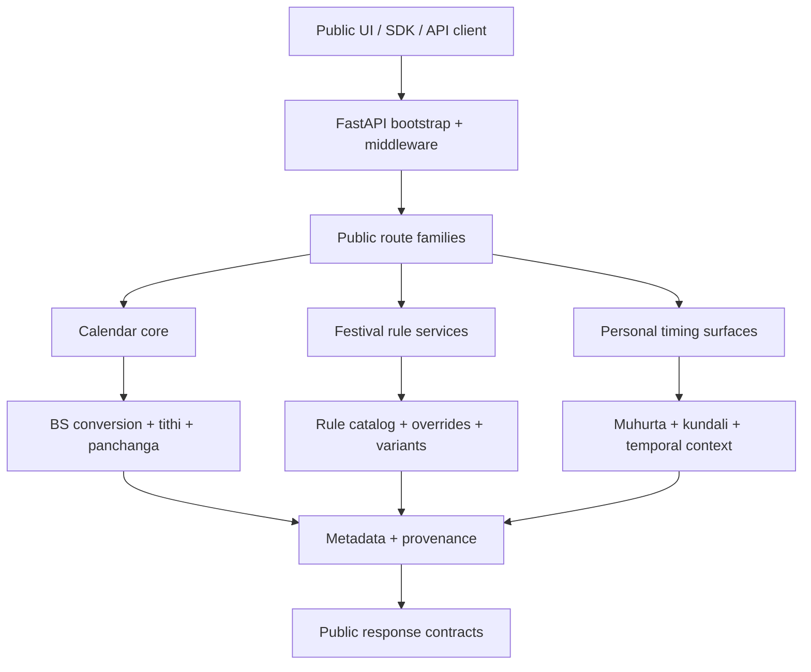

# Engine Architecture

## Runtime layers
1. `calendar/*`
   - BS conversion
   - tithi, panchanga, sankranti, and core astronomical helpers
2. `rules/*`
   - festival rule loading, canonical catalogs, and rule service orchestration
3. `api/*`
   - public `/v3/api/*` and `/api/*` compatibility surfaces
4. `bootstrap/*`
   - app factory, route policy, middleware, and startup validation
5. `provenance/*` + `explainability/*`
   - trace storage, snapshot manifests, and response provenance

## Canonical engine decision
- Canonical public engine id: `parva-v3-canonical`
- Canonical manifest version: `2026-03-20`
- Operational source of truth: `GET /api/engine/manifest` and `GET /v3/api/engine/manifest`

The canonical engine keeps the public route surface stable while making the runtime identity explicit.
Legacy calculators remain available only as compatibility components behind the manifest instead of as competing public engines.

## Public route families
- `calendar_core`
  - `/api/calendar/convert`
  - `/api/calendar/today`
  - `/api/calendar/panchanga`
  - `/api/calendar/tithi`
  - canonical runtime: `app.calendar.routes`, `app.calendar.bikram_sambat`, `app.calendar.panchanga`, `app.calendar.tithi`
- `festival_rules`
  - `/api/festivals/*`
  - `/api/calendar/festivals/calculate/{festival_id}`
  - `/api/calendar/festivals/upcoming`
  - canonical runtime: `app.rules.service.FestivalRuleService`, `app.calendar.calculator_v2`, `app.rules.catalog_v4`
  - compatibility components: `app.calendar.calculator`, `app.calendar.festival_rules.json`
- `personal_stack`
  - `/api/personal/*`
  - `/api/muhurta/*`
  - `/api/kundali/*`
  - `/api/temporal/*`
  - canonical runtime: `app.api.personal_routes`, `app.api.muhurta_routes`, `app.api.kundali_routes`, `app.api.temporal_compass_routes`

## Request flow (v3)
1. Request enters the FastAPI app factory.
2. Request-size guard validates query and body limits using bounded ASGI handling.
3. Route policy and rate-limit middleware classify and authorize the request.
4. Router resolves the request to the public v3 surface (`/v3/api/*` or `/api/*` alias).
5. Canonical engine modules compute the result.
6. Response metadata adds engine headers, provenance fields, and degraded-state details where applicable.

## Provenance model
- Snapshot manifests describe the actual runtime inputs used to produce public results.
- `manifest_hash` covers the immutable snapshot manifest payload.
- `attestation` covers the signed runtime payload.
- When `PARVA_PROVENANCE_ATTESTATION_KEY` is configured, Parva emits `hmac-sha256` attestations.
- Without a configured key, Parva emits explicit `unsigned` attestations instead of pseudo-signatures.

## Public and experimental profiles
- Public: `/v3/api/*` and `/api/*`
- Experimental: `/v2`, `/v4`, `/v5` only when `PARVA_ENABLE_EXPERIMENTAL_API=true`

## Personal stack
- `personal/panchanga` -> panchanga + BS + trace
- `muhurta` -> day partition, rahu-kalam, and ceremony filters
- `kundali` -> graha positions, lagna, houses, D9, and dasha

All personal endpoints remain deterministic for fixed input and snapshot state.
