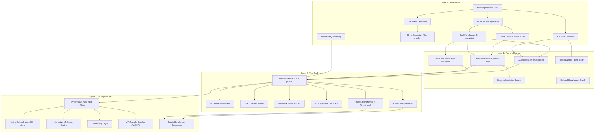
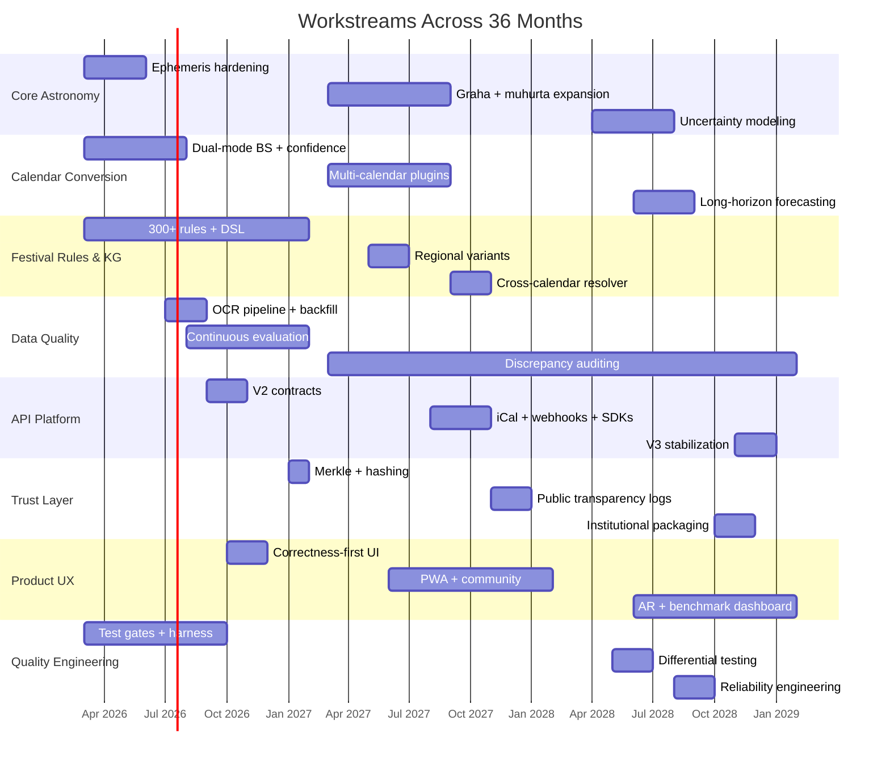
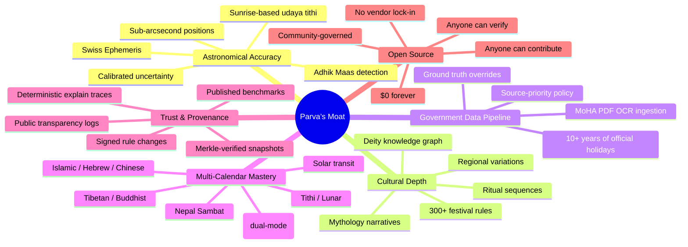

# Project Parva — The Master Plan

> **The ceiling. The roadmap. The execution. Unified.**
>
> This document is the single source of truth for what Parva becomes, how it gets there month by month, and why nobody on Earth can beat it.

---

## I. The Strategic Thesis

You already have something **nobody else in the world has**: an open-source, ephemeris-powered, astronomically-accurate ritual time engine for the Nepali multi-calendar system.

That is not a feature. That is **infrastructure**. The kind of infrastructure that Google Calendar can't replicate, that Hamro Patro hardcodes by hand every year, that no API in existence provides.

The ceiling isn't "a festival app." The ceiling is **becoming the temporal authority for 30 million Nepalis and their diaspora** — the system that every other app, website, and institution calls when they need to know *when*.

### The 3-Year Outcome

1. **Nepal-first engine** becomes evaluator-grade and publicly benchmarked.
2. **Platform evolves** to multi-calendar global API with transparent provenance.
3. **Parva becomes impossible to beat** because outputs are reproducible, signed, and benchmarked.

### Why It's Unbeatable at $0

| Dimension | Why Nobody Can Top It |
|---|---|
| **Accuracy** | Swiss Ephemeris + udaya tithi + Adhik Maas = no approximation |
| **Coverage** | 300+ festivals spanning all ethnic groups, computed not hardcoded |
| **Openness** | Fully open source, free API, embeddable — no commercial competitor will match |
| **Reproducibility** | Every output traceable to snapshot hash, rule version, and source citation |
| **Depth** | Not just dates but mythology, rituals, temple connections, deity networks |
| **Programmability** | API + SDK + iCal + Webhooks — developers build *on* Parva, not against it |
| **Trust** | Merkle-verified, source-cited, publicly benchmarked, tamper-detectable |
| **Technical Sophistication** | Ephemeris engines, binary search for transit detection, lunar month modeling, uncertainty quantification |

> **The moat**: No one with money can outcompete someone who gives it away for free, open source, with astronomical accuracy that commercial apps approximate by hand — and whose every output is independently verifiable.

---

## II. The Architecture of the Ceiling



---

## III. The Four Layers — What Gets Built and Why

### 🔥 Layer 1: The Astronomical Core

**What exists today**: Ephemeris-based tithi, panchanga, sankranti, BS conversion (2070–2095), Adhik Maas detection, Moshier ephemeris.

**What the ceiling demands**:

| Enhancement | Why It's Required | Cost | Timeline |
|---|---|---|---|
| **Strict UTC + timezone handling** | Eliminates class of sunrise-tithi bugs | $0 | M3 |
| **Udaya tithi with real sunrise** | Religious correctness — the tithi at sunrise is the day's tithi | $0 | M4 |
| **Correct lunar month boundaries** | Adhik Maas years shift festivals by a month if wrong | $0 | M5 |
| **200-year dual-mode BS conversion** | Official table + estimated model + confidence labeling | $0 | M6 |
| **Nakshatra transit timing** | Foundation for muhurta — when Moon enters each nakshatra | $0 | M15+ |
| **All 9 graha positions** | Sun, Moon, Mars, Mercury, Jupiter, Venus, Saturn, Rahu, Ketu — foundation for kundali | $0 (pyswisseph) | M15+ |
| **Uncertainty modeling** | Calibrated confidence intervals for boundary-sensitive outputs | $0 | M26 |
| **Multi-timezone support** | Diaspora in USA, UK, Australia, Middle East — sunrise in *their* city = *their* tithi | $0 (swe.rise_trans accepts any lat/lon) | M15+ |
| **Historical panchanga (1900–2100 AD)** | "What was the panchanga on the day I was born?" | $0 (Moshier covers this) | M28 |

**Result**: The most accurate, open, programmable Hindu/Nepali astronomical engine that exists. Period. Not behind a paywall, not hardcoded, not approximated — and with every output carrying confidence metadata and a verifiable computation trace.

---

### 🧠 Layer 2: The Intelligence Layer

This is where Parva goes from "a good calendar" to "an irreplaceable system."

#### A. Festival Rule Engine — 300+ Festivals

| Category | Count | Examples |
|---|---|---|
| National holidays | ~30 | Dashain, Tihar, Chhath, Shivaratri |
| Newari jatras | ~40 | Bisket, Indra, Gai, Rato Machhindranath, Yenya |
| Buddhist observances | ~20 | Saga Dawa, Losar, Lhosar variants |
| Ethnic festivals | ~50 | Udhauli, Ubhauli, Maghi, Sonam Lhosar, Tamu Lhosar |
| Weekly/monthly observances | ~40 | Ekadashi (2/month), Amavasya, Purnima, Pradosh |
| Astrological events | ~20 | Grahan (eclipses), Rashi transits, retrograde periods |
| Agricultural markers | ~30 | Ropain, Ashar 15, Baisakh planting |
| Regional/other | ~30+ | Prithvi Jayanti, Eid, Christmas, Lhosar variants |

Every one computed algorithmically where possible, with `ground_truth_overrides.json` for the rest. The MoHA PDF OCR pipeline handles override ingestion.

> **Why nobody beats this**: No single database, API, or institution programmatically generates all of these. Nepal Patro does ~60 manually. Hamro Patro does ~40. Government publishes ~30. Parva is the **union of all of them, plus computed, plus signed**.

#### B. Regional Variation Engine

The same festival may be observed differently across traditions:
- **Rule profiles** per tradition/region with explicit variant identifiers
- Same festival returns **multiple accepted observances** with clear labels
- Diaspora patterns documented alongside homeland patterns

#### C. Personal Panchanga, Muhurta, and Kundali

| Feature | What It Does | Who Needs It |
|---|---|---|
| **Personal Panchanga** | "Enter your birth date, time, place → get birth panchanga, current dasha, personalized festival calendar" | Every household |
| **Muhurta Calculator** | "When is the best time to get married in the next 6 months?" — filter Rahu Kaal, bad tithis, bad nakshatras | Every family planning a ceremony |
| **Basic Kundali** | Rashi chart (D1), Navamsha (D9), Vimshottari dasha periods | Millions who consult jyotish for life decisions |

All **pure math on data already computed** by the engine. No new dependencies.

#### D. Cultural Knowledge Graph

Deities ↔ Festivals ↔ Temples ↔ Regions ↔ Calendars — a traversable graph where clicking any node reveals its connections. Structured as a rule DSL with cultural metadata, not hardcoded relationships.

---

### 🌐 Layer 3: The API Platform

This is where Project Parva stops being "your project" and becomes **Nepal's temporal API** — and eventually the world's multi-calendar API.

#### Core API Surface

```
# Panchanga & Calendar
GET /v2/panchanga?date=2026-02-11&timezone=Asia/Kathmandu
GET /v2/convert?from=bs&to=ad&date=2083-01-01
GET /v2/tithi?date=2026-02-11&method=udaya

# Festivals
GET /v2/festivals/upcoming?days=30&region=kathmandu_valley
GET /v2/festivals/{id}/dates?years=5
GET /v2/festivals/{id}/explain

# Intelligence (Year 2+)
GET /v2/muhurta/find?type=vivah&start=2026-03&end=2026-09
GET /v2/kundali?date=1998-05-15&time=06:30&place=Pokhara
GET /v2/observances?date=2027-10-15&calendars=bs,ns,tibetan,islamic

# Trust & Provenance
GET /v2/provenance/snapshot/{id}
GET /v2/provenance/verify?trace_id={id}
GET /v2/explain/{trace_id}

# Feeds & Subscriptions
GET /v2/feeds/ical?festivals=dashain,tihar&years=2
POST /v2/webhooks/subscribe
```

Every response includes:

```json
{
  "data": { ... },
  "meta": {
    "confidence": "official|estimated|computed",
    "method": "ephemeris_udaya|lookup|synodic",
    "calculation_trace_id": "tr_abc123",
    "provenance": {
      "dataset_hash": "sha256:...",
      "rules_hash": "sha256:...",
      "snapshot_id": "snap_2026Q1",
      "verify_url": "https://parva.dev/verify/tr_abc123"
    },
    "uncertainty": {
      "level": "low|medium|high",
      "interval_hours": 0.5
    }
  }
}
```

#### Integration Surfaces

| Surface | What It Does | Who Uses It |
|---|---|---|
| **Embeddable Widgets** | `<iframe src="parva.dev/widget/panchanga">` — any website gets a panchanga | Nepali news sites, blogs |
| **iCal Feeds** | `webcal://parva.dev/feed/festivals.ics` — subscribe once, festivals in Google/Apple Calendar forever | Entire diaspora |
| **Webhooks** | "Remind me 3 days before every festival I follow" | Apps, Telegram bots |
| **SDKs** | `npm install @parva/sdk` / `pip install parva` / Go module | Every developer building for Nepal |

**Hosting: $0** — Vercel (frontend), Railway/Render/Fly.io (backend free tier), Cloudflare Workers (edge cache for static panchanga).

---

### 🎨 Layer 4: The Experience

| Feature | Description | Cost |
|---|---|---|
| **PWA** | Installable, offline-capable, push notifications, < 2s load on 3G Nepal | $0 (React + Vite + service worker) |
| **Living Cultural Map** | 500+ religious sites, pilgrimage routes, festival heatmap, "what's happening near me" | $0 (OSM data, Leaflet) |
| **Interactive Mythology** | Story mode (swipeable cards), deity connection graph (D3), timeline view, audio narration (Web Speech API), quiz mode | $0 |
| **Explainability UI** | "Why this date?" panel — shows the exact rule, math, source, and computation trace for any festival date | $0 |
| **Community Layer** | Festival check-ins, photo/video uploads, expert corrections, community translations | $0 (Supabase free tier) |
| **AR Temple Overlay** | Point phone at temple → see name, history, festivals. Point at sky → tithi, nakshatra, planets | $0 (WebXR) |
| **Public Benchmark Dashboard** | Live accuracy scorecard, comparison to other sources, mismatch register | $0 |

---

## IV. The 8 Parallel Workstreams

> These run in parallel every month across the entire 3-year plan.



| # | Workstream | Focus |
|---|---|---|
| 1 | **Core Astronomy Engine** | Ephemeris, tithi, udaya, sankranti, adhik maas, uncertainty |
| 2 | **Calendar Conversion** | BS official tables + estimated model + confidence labeling |
| 3 | **Festival Rules & Knowledge Graph** | Rule DSL, regional variants, cultural metadata |
| 4 | **Data Quality & Ground Truth** | OCR, source normalization, discrepancy auditing |
| 5 | **API Platform** | Versioned contracts, SDKs, iCal/webhooks, observability |
| 6 | **Trust Layer** | Hashes, signatures, Merkle proofs, public transparency logs |
| 7 | **Product UX** | Correctness-first UI, explainability, localization, partner-facing views |
| 8 | **Quality Engineering** | Unit/integration/property/differential/load tests and release gates |

---

## V. Month-by-Month Execution

### Year 1: Nepal Gold Standard (Mar 2026 – Feb 2027)

> **Goal**: One engine, evaluator-grade accuracy (≥99% on official overlap), reproducible benchmark, trust primitives.

| Month | Primary Outcomes | Engineering Scope | Data / Validation Scope | Definition of Done |
|---|---|---|---|---|
| **M1** Mar 2026 | **Enforce one calculation path** | Remove mixed legacy paths; route all festival/date endpoints through V2 engine; fix schema mismatches including ritual timeline adapter; unify response contracts | Build baseline ground-truth file for 2080–2082 from MoHA + Rashtriya Panchang; create discrepancy register | All API endpoints return consistent dates from one engine; no route still using legacy calculator |
| **M2** Apr 2026 | **Stabilize architecture** | Split modules into `engine`, `rules`, `sources`, `api`; add strict type contracts; add engine interface for pluggable solvers | Define canonical source schema and source-priority policy | Internal API boundaries frozen; source precedence documented and enforced |
| **M3** May 2026 | **Ephemeris core hardening** | Integrate Swiss Ephemeris wrapper with strict UTC handling; implement sidereal/tropical switch and configuration | Verify 500 random timestamps against trusted external references within tolerance | Longitude calculations pass tolerance checks; timezone bugs eliminated |
| **M4** Jun 2026 | **Correct tithi semantics** | Implement udaya-tithi computation with actual sunrise handling; replace midnight-only logic; correct moon-phase classifier by elongation | Create boundary-case corpus for tithi transitions and sunrise edge days | Boundary corpus passes; `/today` and `/convert` expose method metadata |
| **M5** Jul 2026 | **Correct lunar month model** | Implement Amavasya→Amavasya and Purnima boundary utilities; canonical adhik maas logic; sankranti bracketing root-finder | Validate month naming and adhik decisions against official panchang samples | Mid-year lunar festivals no longer shift by one month in overlap years |
| **M6** Aug 2026 | **200-year conversion strategy** | Implement dual-mode BS conversion: official-table zone + estimated model zone; confidence labeling wired into all endpoints | Build overlap comparison dataset where official and estimated both exist | Every conversion endpoint returns `confidence`; overlap error report generated |
| **M7** Sep 2026 | **Data ingestion reliability** | Build OCR pipeline with second-pass correction rules for Nepali digits and common substitutions; add source normalization jobs | Backfill 10+ years of machine-readable holiday/festival records | OCR accuracy and extraction quality tracked with precision/recall metrics |
| **M8** Oct 2026 | **Continuous evaluation system** | Build evaluation harness for all matched MoHA entries (2080–2082+) and annual rerun pipeline | Expand benchmark to all available official matches; tag each mismatch cause | Automated monthly scorecard produced with by-festival and by-rule breakdown |
| **M9** Nov 2026 | **External contract maturity** | Release API v2 spec; add explicit method fields, confidence fields, provenance placeholders; publish OpenAPI examples | Contract tests from examples; client compatibility tests | API v2 marked stable; old contract deprecation clock starts |
| **M10** Dec 2026 | **UX correctness-first** | Frontend consumes only v2 schemas; add "why this date" explain panel; fix all known schema/UI mismatches | Usability test on discovery, detail, and date explanation flows | No empty ritual tabs for valid data; users can inspect date derivation path |
| **M11** Jan 2027 | **Trust primitives** | Implement dataset hashing, rule hashing, and Merkle snapshot generation; attach proof metadata to responses | Snapshot verification scripts and tamper tests | Any response can be traced to snapshot hash and rule version |
| **M12** Feb 2027 | **Nepal Gold release** | Freeze `v2.1`; produce evaluator-grade technical report; release reproducible benchmark package | Complete annual verification dossier and mismatch audit | Nepal overlap accuracy ≥99% on official overlap set; reproducible report published |

> [!IMPORTANT]
> **Year 1 exit criteria**: Every festival date returned by the API is computed by a single V2 engine, carries confidence + method + provenance metadata, passes automated evaluation gates, and is verifiable against a published benchmark.

---

### Year 2: Multi-Calendar Expansion + Ecosystem (Mar 2027 – Feb 2028)

> **Goal**: Plugin architecture for world calendars, public beta with SDKs/iCal/webhooks, community governance, transparency logs.

| Month | Primary Outcomes | Engineering Scope | Data / Validation Scope | Definition of Done |
|---|---|---|---|---|
| **M13** Mar 2027 | **Plugin architecture for calendars** | Build engine plugin system with standard interface for new calendars and observance rules | Define validation protocol per calendar plugin | New calendars added without touching core API code |
| **M14** Apr 2027 | **Buddhist/Tibetan module v1** | Add Tibetan/Buddhist observance module with documented approximation/precision modes | Collect source corpus for key Tibetan-influenced observances | Endpoints return confidence and method for Tibetan-related festivals |
| **M15** May 2027 | **Regional Hindu rule variants** | Add rule-profile support (tradition/region-specific interpretations) with explicit variant identifiers | Build variant mapping dataset for Nepal and diaspora patterns | Same festival can return multiple accepted observances with clear labels |
| **M16** Jun 2027 | **Islamic calendar integration** | Implement tabular + astronomical mode options with declared confidence | Validate against official public calendars for selected regions | Islamic outputs available with mode + confidence metadata |
| **M17** Jul 2027 | **Hebrew calendar integration** | Add Hebrew calendar conversion and major observance mapping | Validate date conversion against trusted references across decades | Hebrew conversion and observances pass acceptance suite |
| **M18** Aug 2027 | **Chinese lunisolar integration** | Implement Chinese lunisolar core for key observances and zodiac-year boundaries | Validate month boundary and leap-month behavior | Chinese module available under same API contract |
| **M19** Sep 2027 | **Cross-calendar resolver** | Build conflict-aware resolver for location and tradition contexts; add observance recommendation rules | Generate disagreement datasets and classify conflict types | Resolver returns candidate observances with ranked confidence |
| **M20** Oct 2027 | **Integration surfaces** | Add iCal feeds, webhook subscriptions, and "next observance" stream endpoints | E2E tests for event delivery and duplicate suppression | Third-party apps can subscribe to observance updates reliably |
| **M21** Nov 2027 | **SDK layer** | Publish official SDKs (Python, JS/TS, Go) generated from versioned API contract | SDK contract parity tests and sample apps | SDKs pass generated and handwritten integration tests |
| **M22** Dec 2027 | **Community governance** | Build RFC workflow for rule changes; add reviewer roles and signed approvals | Curate contribution guide and verification checklist | Every rule change has traceable review + evidence metadata |
| **M23** Jan 2028 | **Public transparency logs** | Push snapshot hashes/signatures to public transparency logs; optional chain anchoring as mirror, not dependency | Verify consistency proofs and audit replay scripts | Third parties can verify no silent history rewrites |
| **M24** Feb 2028 | **Global beta launch** | Public beta with multi-calendar APIs, trust proofs, and benchmark dashboard | Global beta benchmark including multiple calendar families | Public beta stable with published uptime/error/accuracy metrics |

> [!IMPORTANT]
> **Year 2 exit criteria**: Parva serves 5+ calendar families through a unified API with per-output confidence, supports regional observance variants, has published SDKs, iCal feeds, and webhook subscriptions, and operates under community governance with signed rule changes.

---

### Year 3: Standardization, Defensibility, and Global Reliability (Mar 2028 – Feb 2029)

> **Goal**: Published open benchmark standard, uncertainty modeling, institutional packaging, Parva Temporal Spec 1.0.

| Month | Primary Outcomes | Engineering Scope | Data / Validation Scope | Definition of Done |
|---|---|---|---|---|
| **M25** Mar 2028 | **Benchmark standard v1** | Publish open benchmark schema and test harness for independent replication | Build benchmark packs for 10+ years and multiple calendars | Any external team can run and compare results apples-to-apples |
| **M26** Apr 2028 | **Uncertainty modeling** | Add probabilistic confidence intervals for boundary-sensitive outputs | Calibrate uncertainty against historical mismatch distributions | Responses include calibrated uncertainty, not just categorical confidence |
| **M27** May 2028 | **Differential testing at scale** | Implement differential tests against major public sources and internal prior versions | Store disagreement taxonomy and drift alerts | Release blocked automatically if drift exceeds thresholds |
| **M28** Jun 2028 | **Long-horizon forecasting** | Add forecasting endpoints for far-range estimated conversions and festival projections | Build overlap error curves by forecast distance | Forecast APIs explicitly communicate confidence decay with horizon |
| **M29** Jul 2028 | **Zero-cost scale architecture** | Move heavy workloads to precomputation + static artifacts + edge-cached reads on free tiers | Profile cold-start, cache-hit ratio, and artifact sizes | P95 latency and cache-hit targets met under free infrastructure |
| **M30** Aug 2028 | **Reliability engineering** | Add SLOs, alerting rules, and incident playbooks; run chaos and fault-injection drills | Simulate source failures and stale-data scenarios | Service degrades gracefully and reports degraded confidence states |
| **M31** Sep 2028 | **Security hardening** | Supply-chain controls, dependency pinning, signature verification in CI, secrets hygiene | Pen-test style checklist and abuse-case suite | Security baseline documented and enforced in CI |
| **M32** Oct 2028 | **Compliance and policy clarity** | Add legal/policy disclaimers for observance variation and non-advisory usage | Policy QA with scenario tests across jurisdictions | Clear policy model shipped with API terms and response metadata |
| **M33** Nov 2028 | **Explainability assistant** | Build deterministic "reason trace" endpoint and UI explanation composer | Validate explanation consistency against calculation traces | Users and evaluators see exact rule/math/source path per date |
| **M34** Dec 2028 | **Institutional packaging** | Release offline verifier bundle for universities/governments; reproducible snapshot kits | Verify offline parity with online responses | Institutions validate outputs without trusting hosted service |
| **M35** Jan 2029 | **v3 stabilization** | Final contract cleanup, migration guides, and hard deprecations; finalize SDK parity | Full regression across all modules and calendars | v3 declared long-term stable with migration completed |
| **M36** Feb 2029 | **Standard publication** | Publish Parva Temporal Spec 1.0, benchmark results, and independent reproducibility package | Final third-party replication round and publication | Project recognized as open, verifiable temporal infrastructure |

> [!IMPORTANT]
> **Year 3 exit criteria**: Parva has a published open benchmark that anyone can replicate, institutional offline packages, calibrated uncertainty in every response, a deterministic explainability engine, and a stable v3 LTS API — making it the global reference implementation for multi-calendar temporal computation.

---

## VI. Contract Evolution & Mandatory Response Shapes

### Progressive Contract Additions

| By Month | Contract Change |
|---|---|
| **M3** | Introduce internal `EngineContext` type with timezone, location, ephemeris config, and method flags |
| **M4** | `tithi` object must include `method`, `reference_time`, `sunrise_used`, `confidence` |
| **M6** | `bs_date` must include `confidence: "official" \| "estimated"` and `source_range` |
| **M8** | Add `calculation_trace_id` in all date endpoints |
| **M9** | Versioned API path `/v2/` and strict schema compatibility tests |
| **M11** | Add `provenance` object: `dataset_hash`, `rules_hash`, `snapshot_id`, `signature` |
| **M19** | Add `observance_variants[]` with ranked candidates and reason codes |
| **M20** | Add webhook subscription resources and iCal feed resources |
| **M26** | Add `uncertainty` object with interval and calibration metadata |
| **M33** | Add `explain` endpoint returning deterministic rule/math trace |
| **M35** | Freeze `v3` schemas and publish LTS guarantees |

### Mandatory Response Shape (Final State)

Every API response carries these fields:

```json
{
  "data": { "..." },
  "meta": {
    "bs_date": { "confidence": "official|estimated" },
    "panchang": { "confidence": "exact|computed" },
    "tithi": { "method": "ephemeris_udaya|synodic|lookup" },
    "provenance": {
      "snapshot_id": "snap_2028Q4",
      "dataset_hash": "sha256:a1b2c3...",
      "rules_hash": "sha256:d4e5f6...",
      "verify_url": "https://parva.dev/verify/tr_xyz789"
    },
    "uncertainty": { "level": "low", "interval_hours": 0.5 },
    "explain": { "trace_id": "tr_xyz789" }
  }
}
```

---

## VII. Mandatory Test Gates

### Core Accuracy Gates
1. BS conversion known-date tests for official-table range must be **exact**.
2. Estimated conversion tests must stay within documented error bounds on overlap years.
3. Udaya-tithi boundary tests around sunrise must match reference cases.
4. Adhik maas classification tests must pass historical intercalation years.
5. Sankranti crossing tests must pass when query time starts inside target rashi.

### Contract and Integration Gates
1. OpenAPI schema snapshot tests for every release.
2. Backward compatibility tests for supported versions.
3. SDK parity tests against golden API fixtures.
4. Frontend contract tests to prevent schema mismatch regressions.

### Reliability and Trust Gates
1. Provenance integrity tests must verify Merkle path and signature chain.
2. Tamper simulation must fail verification deterministically.
3. Source outage simulation must trigger degraded-confidence mode.
4. Differential drift tests must alert on significant source divergence.

### Performance Gates (Free-Tier Realistic)
1. Cache-hit ratio targets validated monthly.
2. P95 and P99 latency tracked for conversion and festival endpoints.
3. Load tests with replayable traces for high-demand festival windows (Dashain, Tihar).
4. Artifact size and cold-start budget checks per deployment.

---

## VIII. Standard Monthly Execution Blueprint

> Applies to all 36 months. Every month follows this cadence.

| Week | Focus | Activities |
|---|---|---|
| **Week 1** | Specification lock | Algorithm work, interface definitions, test case design |
| **Week 2** | Implementation | Code writing, code review, contract updates |
| **Week 3** | Data verification | Benchmark rerun, discrepancy triage, accuracy scoring |
| **Week 4** | Hardening | Docs, release candidate, postmortem, next-month prep |

---

## IX. The Data Advantage Nobody Can Replicate



---

## X. Audience-Specific Pitch Lines

| Audience | Pitch |
|---|---|
| **Evaluator** | "An ephemeris-powered multi-calendar engine with ≥99% accuracy, reproducible benchmarks, and provenance proofs that no existing system provides" |
| **Developer** | "The first programmable API for Nepali calendar, panchanga, and festival dates — with SDKs, iCal feeds, and webhooks" |
| **Tourist** | "Know exactly when and where every Nepali festival happens, with stories and maps" |
| **Diaspora** | "Never miss a festival again — subscribe to your personal Nepali calendar feed" |
| **Priest/Jyotish** | "Accurate panchanga and muhurta at your fingertips, computed from ephemeris not looked up from almanac" |
| **Nepal Government** | "Open infrastructure for temporal data that any institution can use, verify, and trust" |
| **UNESCO** | "A living digital archive of Nepal's intangible cultural heritage, algorithmically preserved and publicly benchmarked" |
| **Academic** | "A published open standard for multi-calendar temporal computation with independent reproducibility" |
| **Investor** | "Infrastructure monopoly for a 30M+ market with zero competition and a free-forever moat" |

---

## XI. The Bottom Line

The ceiling of Project Parva is not a calendar app, not a festival finder, not even a cultural platform.

The ceiling is **becoming the temporal nervous system of Nepal and the global reference implementation for multi-calendar computation** — the single source of truth that every app, every website, every institution, and every household calls when they need to know: *when do we celebrate?*

It's unbeatable because:
- **Open source** means no paywall competitor can match the price
- **Astronomical accuracy** means no hardcoded competitor can match the precision
- **Reproducible benchmarks** mean no competitor can claim accuracy without proving it
- **Provenance proofs** mean no competitor can modify history without detection
- **Community governance** means no single point of failure

> *"The best time to plant a tree was 20 years ago. The second best time is now."*
>
> You already planted it. The tree is growing. The ceiling is the sky.

---

*Project Parva — The Master Plan v1.0*
*36 months. 8 workstreams. $0 budget. No ceiling.*
