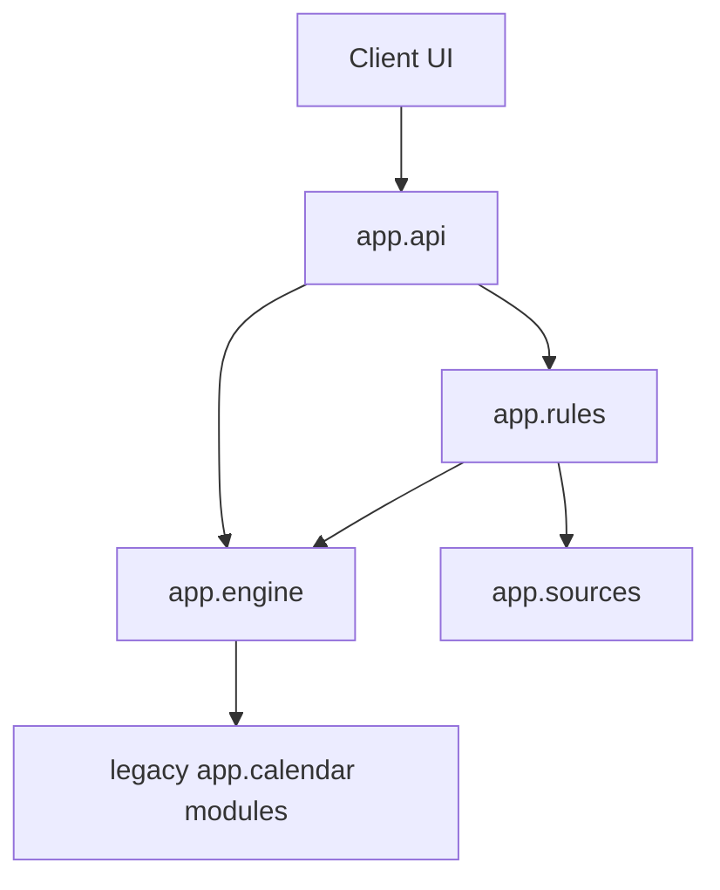

# Project Parva — System Diagrams

## Table of Contents

1. [Entity Relationship Diagram (ERD)](#1-entity-relationship-diagram-erd)
2. [Data Flow Diagram - Level 0 (Context)](#2-data-flow-diagram---level-0-context)
3. [Data Flow Diagram - Level 1](#3-data-flow-diagram---level-1)
4. [Data Flow Diagram - Level 2](#4-data-flow-diagram---level-2)
5. [System Architecture Diagram](#5-system-architecture-diagram)
6. [Component Diagram](#6-component-diagram)
7. [Sequence Diagrams](#7-sequence-diagrams)

---

## 1. ENTITY RELATIONSHIP DIAGRAM (ERD)

### 1.1 Complete ERD

```
┌─────────────────────────────────────────────────────────────────────────────────────────────┐
│                              PROJECT PARVA - ENTITY RELATIONSHIP DIAGRAM                     │
└─────────────────────────────────────────────────────────────────────────────────────────────┘

┌───────────────────────────┐                      ┌───────────────────────────┐
│         FESTIVAL          │                      │          DEITY            │
├───────────────────────────┤                      ├───────────────────────────┤
│ PK  festival_id (str)     │                      │ PK  deity_id (str)        │
│     name_en (str)         │                      │     name_en (str)         │
│     name_np (str)         │                      │     name_np (str)         │
│     category (str)        │◄─────────────────────│     name_sanskrit (str)   │
│     significance (str)    │    worships          │     mythology (text)      │
│     mythology (text)      │    (many-to-many)    │     attributes (json)     │
│     duration_days (int)   │                      │     iconography (text)    │
│     calculation_rule (json│                      │     mantras[] (json)      │
│     is_public_holiday(bool│                      └───────────────────────────┘
│     regions[] (json)      │                                 │
│     rituals[] (json)      │                                 │
└───────────┬───────────────┘                                 │
            │                                                  │
            │ celebrated_at                                    │
            │ (many-to-many)                                   │
            │                                                  │
            ▼                                                  │
┌───────────────────────────┐                                 │
│         TEMPLE            │◄────────────────────────────────┘
├───────────────────────────┤          enshrines
│ PK  temple_id (str)       │          (many-to-many)
│     name_en (str)         │
│     name_np (str)         │
│     latitude (float)      │
│     longitude (float)     │
│     type (str)            │
│     significance (text)   │
│     location_desc (str)   │
│     opening_hours (json)  │
│     festivals[] (fk)      │
│     primary_deity (fk)    │──────────────────────────────────────────┐
│     secondary_deities[](fk│                                          │
└───────────────────────────┘                                          │
                                                                       │
                                                                       │
┌───────────────────────────┐       ┌───────────────────────────┐     │
│      RITUAL_DAY           │       │      CALCULATION_RULE     │     │
├───────────────────────────┤       ├───────────────────────────┤     │
│ PK  ritual_day_id (int)   │       │ PK  rule_id (str)         │     │
│ FK  festival_id (str)     │◄──────│     rule_type (enum)      │     │
│     day_number (int)      │       │     calendar_type (str)   │     │
│     name_en (str)         │       │     month (int/str)       │     │
│     name_np (str)         │       │     day (int)             │     │
│     description (text)    │       │     tithi (int)           │     │
│     rituals[] (json)      │       │     paksha (str)          │     │
│     timings (json)        │       │     adhik_policy (str)    │     │
│     food_items[] (json)   │       │     offset_days (int)     │     │
│     dress_code (str)      │       └───────────────────────────┘     │
└───────────────────────────┘                                          │
                                                                       │
                                                                       │
┌───────────────────────────┐       ┌───────────────────────────┐     │
│     DATE_OVERRIDE         │       │      BS_MONTH_DATA        │     │
├───────────────────────────┤       ├───────────────────────────┤     │
│ PK  override_id (int)     │       │ PK  (bs_year, bs_month)   │     │
│     festival_id (str)     │       │     bs_year (int)         │     │
│     year (int)            │       │     bs_month (int)        │     │
│     gregorian_date (date) │       │     days_in_month (int)   │     │
│     source (str)          │       │     gregorian_start (date)│     │
│     verified (bool)       │       │     confidence (str)      │     │
│     notes (text)          │       └───────────────────────────┘     │
└───────────────────────────┘                                          │
                                                                       │
                                                                       │
┌───────────────────────────┐       ┌───────────────────────────┐     │
│     LUNAR_MONTH           │       │       RASHI               │     │
├───────────────────────────┤       ├───────────────────────────┤     │
│ PK  lunar_month_id (int)  │       │ PK  rashi_id (int 0-11)   │◄────┘
│     name_en (str)         │       │     name_en (str)         │  (located_in)
│     name_np (str)         │       │     name_np (str)         │
│     name_sanskrit (str)   │       │     name_sanskrit (str)   │
│     index (int 1-12)      │       │     start_degree (float)  │
│     season (str)          │       │     end_degree (float)    │
│     auspicious_for (json) │       │     ruling_planet (str)   │
└───────────────────────────┘       │     element (str)         │
                                    └───────────────────────────┘


┌───────────────────────────┐       ┌───────────────────────────┐
│     NAKSHATRA             │       │       TITHI               │
├───────────────────────────┤       ├───────────────────────────┤
│ PK  nakshatra_id (int 1-27│       │ PK  tithi_id (int 1-15)   │
│     name_en (str)         │       │     name_en (str)         │
│     name_np (str)         │       │     name_np (str)         │
│     name_sanskrit (str)   │       │     name_sanskrit (str)   │
│     start_degree (float)  │       │     deity (str)           │
│     end_degree (float)    │       │     significance (text)   │
│     ruling_deity (str)    │       │     auspicious_for (json) │
│     characteristics (json)│       │     avoid_for (json)      │
└───────────────────────────┘       └───────────────────────────┘
```

### 1.2 ERD Relationships Summary

| Entity 1 | Relationship | Entity 2 | Cardinality |
|----------|--------------|----------|-------------|
| FESTIVAL | worships | DEITY | Many-to-Many |
| FESTIVAL | celebrated_at | TEMPLE | Many-to-Many |
| FESTIVAL | has_rules | CALCULATION_RULE | One-to-One |
| FESTIVAL | has_days | RITUAL_DAY | One-to-Many |
| FESTIVAL | has_overrides | DATE_OVERRIDE | One-to-Many |
| TEMPLE | enshrines | DEITY | Many-to-Many |
| TEMPLE | located_in | RASHI (region) | Many-to-One |
| DEITY | primary_at | TEMPLE | One-to-Many |

### 1.3 ERD Notation Legend

```
┌─────────────────────────────────────────────────────────────────┐
│                         LEGEND                                   │
├─────────────────────────────────────────────────────────────────┤
│                                                                  │
│   ┌───────────────────┐                                         │
│   │     ENTITY        │  = Entity (Table/Collection)            │
│   ├───────────────────┤                                         │
│   │ PK  primary_key   │  PK = Primary Key                       │
│   │ FK  foreign_key   │  FK = Foreign Key                       │
│   │     attribute     │  Regular attribute                       │
│   └───────────────────┘                                         │
│                                                                  │
│   ──────────►  = One-to-Many relationship                       │
│   ◄──────────► = Many-to-Many relationship                      │
│   ──────────   = One-to-One relationship                        │
│                                                                  │
└─────────────────────────────────────────────────────────────────┘
```

---

## 2. DATA FLOW DIAGRAM - LEVEL 0 (CONTEXT)

### 2.1 Context Diagram

```
┌─────────────────────────────────────────────────────────────────────────────────────────────┐
│                        DATA FLOW DIAGRAM - LEVEL 0 (CONTEXT DIAGRAM)                         │
└─────────────────────────────────────────────────────────────────────────────────────────────┘


                              Festival Query
    ┌───────────┐         ──────────────────────────►         ┌─────────────────────────┐
    │           │                                              │                         │
    │           │         Festival Data (dates, info)          │                         │
    │   USER    │         ◄──────────────────────────          │                         │
    │ (Tourist/ │                                              │                         │
    │  Diaspora)│         Date Conversion Request              │                         │
    │           │         ──────────────────────────►          │                         │
    │           │                                              │      PROJECT PARVA      │
    │           │         Converted Date (BS/AD)               │                         │
    │           │         ◄──────────────────────────          │        SYSTEM           │
    └───────────┘                                              │                         │
                                                               │    (Ritual Time Engine) │
                                                               │                         │
                              API Request (GET)                │                         │
    ┌───────────┐         ──────────────────────────►          │                         │
    │           │                                              │                         │
    │ DEVELOPER │                                              │                         │
    │  (Third   │         JSON Response                        │                         │
    │   Party)  │         ◄──────────────────────────          │                         │
    │           │                                              │                         │
    └───────────┘                                              └────────────┬────────────┘
                                                                            │
                                                                            │
                                                                            │ Reads
                                                                            │
                                                                            ▼
                                                               ┌─────────────────────────┐
                                                               │                         │
                                                               │      DATA STORES        │
                                                               │                         │
                                                               │  - festivals.json       │
                                                               │  - temples.json         │
                                                               │  - deities.json         │
                                                               │  - bs_month_lengths     │
                                                               │  - overrides.py         │
                                                               │                         │
                                                               └─────────────────────────┘
```

### 2.2 External Entities

| Entity | Type | Description |
|--------|------|-------------|
| USER | External | Tourist, diaspora, or local person seeking festival information |
| DEVELOPER | External | Third-party application developer using the API |
| DATA STORES | Internal | JSON files and Python modules containing calendar/festival data |

---

## 3. DATA FLOW DIAGRAM - LEVEL 1

### 3.1 Level 1 DFD - Process Decomposition

```
┌─────────────────────────────────────────────────────────────────────────────────────────────┐
│                                DATA FLOW DIAGRAM - LEVEL 1                                   │
└─────────────────────────────────────────────────────────────────────────────────────────────┘


                                    Festival Query
    ┌───────────┐               ────────────────────►
    │           │                                              ┌───────────────────────┐
    │   USER    │               Festival List/Details          │                       │
    │           │               ◄────────────────────          │   1.0                 │
    └───────────┘                                              │   FESTIVAL            │
                                                               │   SERVICE             │
                                                               │                       │
                                                               └───────────┬───────────┘
                                                                           │
                               Date Conversion Request                     │ Festival
    ┌───────────┐               ────────────────────►                     │ Rules
    │           │                                              ┌──────────┴───────────┐
    │   USER    │               Converted Date                 │                      │
    │           │               ◄────────────────────          │   2.0                │
    └───────────┘                                              │   CALENDAR           │◄──────┐
                                                               │   ENGINE             │       │
                                                               │                      │       │
                                                               └───────────┬──────────┘       │
                                                                           │                  │
                               Temple Query                                │ Tithi/BS        │
    ┌───────────┐               ────────────────────►                     │ Data            │
    │           │                                              ┌──────────┴───────────┐      │
    │   USER    │               Temple Data + Map              │                      │      │
    │           │               ◄────────────────────          │   3.0                │      │
    └───────────┘                                              │   LOCATION           │      │
                                                               │   SERVICE            │      │
                                                               │                      │      │
                                                               └──────────────────────┘      │
                                                                                             │
                                                                                             │
                               API Request                                                   │
    ┌───────────┐               ────────────────────►          ┌──────────────────────┐      │
    │           │                                              │                      │      │
    │ DEVELOPER │                                              │   4.0                │      │
    │           │               JSON Response                  │   API                │──────┘
    │           │               ◄────────────────────          │   GATEWAY            │
    └───────────┘                                              │                      │
                                                               └──────────┬───────────┘
                                                                          │
                                                                          │ Reads
                                                                          ▼
                                           ┌───────────────────────────────────────────────────┐
                                           │                                                   │
                    ┌──────────────────────┼───────────────────────────────────────────────┐   │
                    │                      │                                               │   │
                    ▼                      ▼                                               ▼   │
           ┌──────────────┐       ┌──────────────┐    ┌──────────────┐           ┌──────────────┐
           │  D1          │       │  D2          │    │  D3          │           │  D4          │
           │  FESTIVAL    │       │  CALENDAR    │    │  TEMPLE      │           │  DEITY       │
           │  DATA        │       │  DATA        │    │  DATA        │           │  DATA        │
           │              │       │              │    │              │           │              │
           │festivals.json│       │constants.py  │    │temples.json  │           │deities.json  │
           │overrides.py  │       │bs_month_lens │    │              │           │              │
           │rules.json    │       │              │    │              │           │              │
           └──────────────┘       └──────────────┘    └──────────────┘           └──────────────┘
```

### 3.2 Process Descriptions

| Process | Name | Description |
|---------|------|-------------|
| 1.0 | Festival Service | Handles festival queries, searches, upcoming festivals |
| 2.0 | Calendar Engine | BS conversion, tithi calculation, panchanga |
| 3.0 | Location Service | Temple data and map integration |
| 4.0 | API Gateway | Routes requests to appropriate service |

### 3.3 Data Stores

| Store | Name | Contents |
|-------|------|----------|
| D1 | Festival Data | festivals.json, overrides.py, rules.json |
| D2 | Calendar Data | constants.py, bs_month_lengths |
| D3 | Temple Data | temples.json |
| D4 | Deity Data | deities.json |

---

## 4. DATA FLOW DIAGRAM - LEVEL 2

### 4.1 Level 2 DFD - Calendar Engine Decomposition

```
┌─────────────────────────────────────────────────────────────────────────────────────────────┐
│                         DATA FLOW DIAGRAM - LEVEL 2: CALENDAR ENGINE                         │
└─────────────────────────────────────────────────────────────────────────────────────────────┘


                        Gregorian Date
                        ──────────────────────►
    ┌───────────┐                                              ┌───────────────────────┐
    │           │       BS Date + Confidence                   │                       │
    │   2.0     │       ◄──────────────────────                │   2.1                 │
    │ CALENDAR  │                                              │   BIKRAM SAMBAT       │
    │  ENGINE   │                                              │   CONVERTER           │
    │           │                                              │                       │
    │ (from L1) │                                              └───────────┬───────────┘
    └─────┬─────┘                                                          │
          │                                                                │ Lookup
          │                                                                ▼
          │                                                    ┌───────────────────────┐
          │              Date                                  │        D2.1           │
          │              ──────────────────────►               │   BS_MONTH_LENGTHS    │
          │                                      ┌─────────────│   (Lookup Table)      │
          │              Tithi + Paksha          │             │                       │
          │              ◄──────────────────────┐│             │   2070-2095 BS        │
          │                                     ││             └───────────────────────┘
          │                                     ▼│
          │                                ┌───────────────────────┐
          │                                │                       │
          │                                │   2.2                 │
          │                                │   TITHI               │
          │                                │   CALCULATOR          │
          │                                │                       │
          │                                └───────────┬───────────┘
          │                                            │
          │                                            │ Sun/Moon
          │                                            │ Positions
          │                                            ▼
          │                                ┌───────────────────────┐
          │                                │        D2.2           │
          │                                │   EPHEMERIS           │
          │                                │   (pyswisseph)        │
          │                                │                       │
          │                                │   Swiss/Moshier       │
          │                                └───────────────────────┘
          │
          │              Date                          ┌───────────────────────┐
          │              ──────────────────────►       │                       │
          │                                            │   2.3                 │
          │              Full Panchanga                │   PANCHANGA           │
          │              ◄──────────────────────       │   CALCULATOR          │
          │                                            │                       │
          │                                            │ (Tithi, Nakshatra,    │
          │                                            │  Yoga, Karana, Vaara) │
          │                                            └───────────────────────┘
          │
          │
          │              Festival + Year               ┌───────────────────────┐
          │              ──────────────────────►       │                       │
          │                                            │   2.4                 │
          │              Festival Date(s)              │   FESTIVAL DATE       │
          │              ◄──────────────────────       │   CALCULATOR          │
          │                                            │                       │
          │                                            └───────────┬───────────┘
          │                                                        │
          │                                            ┌───────────┴───────────┐
          │                                            │                       │
          │                                            ▼                       ▼
          │                                ┌───────────────────┐   ┌───────────────────┐
          │                                │      D2.3         │   │      D2.4         │
          │                                │  OVERRIDE         │   │  FESTIVAL         │
          │                                │  DATABASE         │   │  RULES            │
          │                                │                   │   │                   │
          │                                │  (official dates) │   │  (calculation)    │
          │                                └───────────────────┘   └───────────────────┘
          │
          │
          │              Rashi + Year                  ┌───────────────────────┐
          │              ──────────────────────►       │                       │
          │                                            │   2.5                 │
          │              Sankranti Date/Time           │   SANKRANTI           │
          └              ◄──────────────────────       │   DETECTOR            │
                                                       │                       │
                                                       └───────────────────────┘
```

### 4.2 Level 2 Process Descriptions

| Process | Name | Input | Output |
|---------|------|-------|--------|
| 2.1 | BS Converter | Gregorian date | BS date, confidence |
| 2.2 | Tithi Calculator | Date | Tithi number, paksha, name |
| 2.3 | Panchanga Calculator | Date | 5-limb panchanga |
| 2.4 | Festival Date Calculator | Festival ID, year | Start/end dates |
| 2.5 | Sankranti Detector | Rashi, year | Transit date/time |

---

## 5. SYSTEM ARCHITECTURE DIAGRAM

### 5.1 Three-Tier Architecture

```
┌─────────────────────────────────────────────────────────────────────────────────────────────┐
│                              PROJECT PARVA - SYSTEM ARCHITECTURE                             │
└─────────────────────────────────────────────────────────────────────────────────────────────┘


    ═══════════════════════════════════════════════════════════════════════════════════════════
    ║                                  PRESENTATION TIER                                       ║
    ═══════════════════════════════════════════════════════════════════════════════════════════
    ║                                                                                          ║
    ║    ┌─────────────────────────────────────────────────────────────────────────────────┐  ║
    ║    │                            React Frontend (Vite)                                 │  ║
    ║    ├─────────────────────────────────────────────────────────────────────────────────┤  ║
    ║    │                                                                                  │  ║
    ║    │   ┌───────────────┐   ┌───────────────┐   ┌───────────────┐   ┌──────────────┐  │  ║
    ║    │   │ Festival List │   │Festival Detail│   │ Calendar View │   │  Temple Map  │  │  ║
    ║    │   │   Component   │   │   Component   │   │   Component   │   │  Component   │  │  ║
    ║    │   └───────────────┘   └───────────────┘   └───────────────┘   └──────────────┘  │  ║
    ║    │                                                                                  │  ║
    ║    │   ┌─────────────────────────────────────────────────────────────────────────┐   │  ║
    ║    │   │                         API Service Layer (Hooks)                        │   │  ║
    ║    │   │         useFestivals()   useCalendar()   useTemples()                   │   │  ║
    ║    │   └─────────────────────────────────────────────────────────────────────────┘   │  ║
    ║    └─────────────────────────────────────────────────────────────────────────────────┘  ║
    ║                                             │                                            ║
    ═══════════════════════════════════════════════│════════════════════════════════════════════
                                                   │ HTTP/REST
                                                   ▼
    ═══════════════════════════════════════════════════════════════════════════════════════════
    ║                                    APPLICATION TIER                                      ║
    ═══════════════════════════════════════════════════════════════════════════════════════════
    ║                                                                                          ║
    ║    ┌─────────────────────────────────────────────────────────────────────────────────┐  ║
    ║    │                           FastAPI Backend                                        │  ║
    ║    ├─────────────────────────────────────────────────────────────────────────────────┤  ║
    ║    │                                                                                  │  ║
    ║    │   ┌─────────────────────────────────────────────────────────────────────────┐   │  ║
    ║    │   │                           API Routes Layer                               │   │  ║
    ║    │   │  /api/festivals  /api/calendar  /api/temples  /api/deities  /api/health │   │  ║
    ║    │   └─────────────────────────────────────────────────────────────────────────┘   │  ║
    ║    │                                     │                                            │  ║
    ║    │   ┌─────────────────────────────────┼───────────────────────────────────────┐   │  ║
    ║    │   │                       Service Layer                                      │   │  ║
    ║    │   │   ┌─────────────┐   ┌─────────────┐   ┌─────────────┐   ┌────────────┐  │   │  ║
    ║    │   │   │  Festival   │   │  Calendar   │   │  Location   │   │ Mythology  │  │   │  ║
    ║    │   │   │  Service    │   │   Engine    │   │  Service    │   │  Service   │  │   │  ║
    ║    │   │   └─────────────┘   └─────────────┘   └─────────────┘   └────────────┘  │   │  ║
    ║    │   └─────────────────────────────────────────────────────────────────────────┘   │  ║
    ║    │                                     │                                            │  ║
    ║    │   ┌─────────────────────────────────┼───────────────────────────────────────┐   │  ║
    ║    │   │                      Engine Layer                                        │   │  ║
    ║    │   │   ┌─────────────┐   ┌─────────────┐   ┌─────────────┐   ┌────────────┐  │   │  ║
    ║    │   │   │  BS         │   │   Tithi     │   │  Panchanga  │   │  Festival  │  │   │  ║
    ║    │   │   │  Converter  │   │   Calc      │   │   Calc      │   │  Rules     │  │   │  ║
    ║    │   │   └─────────────┘   └─────────────┘   └─────────────┘   └────────────┘  │   │  ║
    ║    │   └─────────────────────────────────────────────────────────────────────────┘   │  ║
    ║    │                                     │                                            │  ║
    ║    │   ┌─────────────────────────────────┼───────────────────────────────────────┐   │  ║
    ║    │   │                   External Libraries                                     │   │  ║
    ║    │   │              pyswisseph (Swiss Ephemeris)                               │   │  ║
    ║    │   └─────────────────────────────────────────────────────────────────────────┘   │  ║
    ║    └─────────────────────────────────────────────────────────────────────────────────┘  ║
    ║                                             │                                            ║
    ═══════════════════════════════════════════════│════════════════════════════════════════════
                                                   │ File I/O
                                                   ▼
    ═══════════════════════════════════════════════════════════════════════════════════════════
    ║                                       DATA TIER                                          ║
    ═══════════════════════════════════════════════════════════════════════════════════════════
    ║                                                                                          ║
    ║    ┌───────────────┐   ┌───────────────┐   ┌───────────────┐   ┌───────────────────┐    ║
    ║    │festivals.json │   │ temples.json  │   │ deities.json  │   │ bs_constants.py   │    ║
    ║    │               │   │               │   │               │   │                   │    ║
    ║    │ - 21 festivals│   │ - 15+ temples │   │ - 20+ deities │   │ - 2070-2095 BS    │    ║
    ║    │ - rules       │   │ - coordinates │   │ - mythology   │   │ - month lengths   │    ║
    ║    │ - mythology   │   │ - festivals   │   │ - attributes  │   │                   │    ║
    ║    └───────────────┘   └───────────────┘   └───────────────┘   └───────────────────┘    ║
    ║                                                                                          ║
    ║    ┌───────────────────────────────────────────────────────────────────────────────┐    ║
    ║    │                              overrides.py                                      │    ║
    ║    │                    (Official festival dates 2025-2027)                        │    ║
    ║    └───────────────────────────────────────────────────────────────────────────────┘    ║
    ║                                                                                          ║
    ═══════════════════════════════════════════════════════════════════════════════════════════
```

---

## 6. COMPONENT DIAGRAM

### 6.1 Backend Component Diagram

```
┌─────────────────────────────────────────────────────────────────────────────────────────────┐
│                               BACKEND COMPONENT DIAGRAM                                      │
└─────────────────────────────────────────────────────────────────────────────────────────────┘


    ┌─────────────────────────────────────────────────────────────────────────────────────────┐
    │                                    app/                                                  │
    ├─────────────────────────────────────────────────────────────────────────────────────────┤
    │                                                                                          │
    │    ┌───────────────────────────────────────────────────────────────────────────────┐    │
    │    │                              main.py                                           │    │
    │    │                        (FastAPI Application)                                  │    │
    │    └───────────────────────────────────────────────────────────────────────────────┘    │
    │                                         │                                               │
    │              ┌──────────────────────────┼──────────────────────────┐                   │
    │              │                          │                          │                    │
    │              ▼                          ▼                          ▼                    │
    │    ┌─────────────────┐       ┌─────────────────┐       ┌─────────────────┐             │
    │    │   calendar/     │       │   festivals/    │       │   locations/    │             │
    │    │   «package»     │       │   «package»     │       │   «package»     │             │
    │    └────────┬────────┘       └────────┬────────┘       └────────┬────────┘             │
    │             │                         │                         │                       │
    │    ┌────────┴────────┐       ┌────────┴────────┐       ┌────────┴────────┐             │
    │    │                 │       │                 │       │                 │              │
    │    ▼                 ▼       ▼                 │       ▼                 │              │
    │ ┌──────────┐ ┌───────────┐ ┌───────────┐      │    ┌───────────┐        │              │
    │ │bikram_   │ │  tithi.py │ │ routes.py │      │    │ routes.py │        │              │
    │ │sambat.py │ │           │ │           │      │    │           │        │              │
    │ └──────────┘ └───────────┘ └───────────┘      │    └───────────┘        │              │
    │      │            │              │            │          │              │               │
    │      ▼            ▼              │            ▼          │              │               │
    │ ┌──────────┐ ┌───────────┐       │    ┌───────────┐      │              │               │
    │ │constants │ │ephemeris/ │       │    │ service.py│      │              │               │
    │ │.py       │ │swiss_eph  │       │    │           │      │              │               │
    │ └──────────┘ │.py        │       │    └───────────┘      │              │               │
    │              └───────────┘       │          │            │              │               │
    │                   │              │          ▼            │              │               │
    │                   ▼              │    ┌───────────┐      │              │               │
    │              ┌───────────┐       │    │calculator │      │              │               │
    │              │pyswisseph │       │    │_v2.py     │      │              │               │
    │              │ «library» │       │    └───────────┘      │              │               │
    │              └───────────┘       │          │            │              │               │
    │                                  │          ▼            │              │               │
    │                                  │    ┌───────────┐      │              │               │
    │                                  │    │overrides  │      │              │               │
    │                                  │    │.py        │      │              │               │
    │                                  │    └───────────┘      │              │               │
    │                                  │                       │              │               │
    │                                  ▼                       ▼              ▼               │
    │                          ┌─────────────────────────────────────────────────┐            │
    │                          │                   data/                          │           │
    │                          │   festivals.json  temples.json  deities.json    │           │
    │                          └─────────────────────────────────────────────────┘            │
    │                                                                                         │
    └─────────────────────────────────────────────────────────────────────────────────────────┘
```

---

## 7. SEQUENCE DIAGRAMS

### 7.1 Festival Date Query Sequence

```
┌─────────────────────────────────────────────────────────────────────────────────────────────┐
│                     SEQUENCE DIAGRAM: Festival Date Query                                    │
└─────────────────────────────────────────────────────────────────────────────────────────────┘


    ┌──────┐         ┌──────────┐         ┌──────────┐         ┌──────────┐      ┌──────────┐
    │ User │         │ Frontend │         │   API    │         │ Festival │      │ Calendar │
    │      │         │ (React)  │         │ (FastAPI)│         │ Service  │      │ Engine   │
    └──┬───┘         └────┬─────┘         └────┬─────┘         └────┬─────┘      └────┬─────┘
       │                  │                    │                    │                 │
       │  Click Festival  │                    │                    │                 │
       │─────────────────>│                    │                    │                 │
       │                  │                    │                    │                 │
       │                  │ GET /api/festivals │                    │                 │
       │                  │ /dashain?year=2026 │                    │                 │
       │                  │───────────────────>│                    │                 │
       │                  │                    │                    │                 │
       │                  │                    │ get_festival(      │                 │
       │                  │                    │ "dashain", 2026)   │                 │
       │                  │                    │───────────────────>│                 │
       │                  │                    │                    │                 │
       │                  │                    │                    │ check_override()│
       │                  │                    │                    │────────────────>│
       │                  │                    │                    │                 │
       │                  │                    │                    │<────────────────│
       │                  │                    │                    │  [override      │
       │                  │                    │                    │   found]        │
       │                  │                    │                    │                 │
       │                  │                    │<───────────────────│                 │
       │                  │                    │  Festival Data     │                 │
       │                  │                    │                    │                 │
       │                  │<───────────────────│                    │                 │
       │                  │  JSON Response     │                    │                 │
       │                  │                    │                    │                 │
       │<─────────────────│                    │                    │                 │
       │  Render Festival │                    │                    │                 │
       │  Detail View     │                    │                    │                 │
       │                  │                    │                    │                 │
    ┌──┴───┐         ┌────┴─────┐         ┌────┴─────┐         ┌────┴─────┐      ┌────┴─────┐
    │ User │         │ Frontend │         │   API    │         │ Festival │      │ Calendar │
    └──────┘         └──────────┘         └──────────┘         └──────────┘      └──────────┘
```

### 7.2 Date Conversion Sequence

```
┌─────────────────────────────────────────────────────────────────────────────────────────────┐
│                     SEQUENCE DIAGRAM: Date Conversion (BS to Gregorian)                      │
└─────────────────────────────────────────────────────────────────────────────────────────────┘


    ┌──────┐         ┌──────────┐         ┌──────────┐         ┌──────────┐      ┌──────────┐
    │ User │         │ Frontend │         │   API    │         │ Calendar │      │ BS Lookup│
    │      │         │ (React)  │         │ (FastAPI)│         │ Engine   │      │ Table    │
    └──┬───┘         └────┬─────┘         └────┬─────┘         └────┬─────┘      └────┬─────┘
       │                  │                    │                    │                 │
       │  Enter BS Date   │                    │                    │                 │
       │  2082-07-15      │                    │                    │                 │
       │─────────────────>│                    │                    │                 │
       │                  │                    │                    │                 │
       │                  │ GET /api/calendar  │                    │                 │
       │                  │ /convert?bs=2082-  │                    │                 │
       │                  │ 07-15              │                    │                 │
       │                  │───────────────────>│                    │                 │
       │                  │                    │                    │                 │
       │                  │                    │ bs_to_gregorian()  │                 │
       │                  │                    │───────────────────>│                 │
       │                  │                    │                    │                 │
       │                  │                    │                    │ Is year in      │
       │                  │                    │                    │ 2070-2095?      │
       │                  │                    │                    │────────────────>│
       │                  │                    │                    │                 │
       │                  │                    │                    │<────────────────│
       │                  │                    │                    │  YES: lookup    │
       │                  │                    │                    │                 │
       │                  │                    │                    │ Get month       │
       │                  │                    │                    │ lengths         │
       │                  │                    │                    │────────────────>│
       │                  │                    │                    │                 │
       │                  │                    │                    │<────────────────│
       │                  │                    │                    │  [32,31,32...]  │
       │                  │                    │                    │                 │
       │                  │                    │<───────────────────│                 │
       │                  │                    │ {gregorian_date,   │                 │
       │                  │                    │  confidence:       │                 │
       │                  │                    │  "official"}       │                 │
       │                  │                    │                    │                 │
       │                  │<───────────────────│                    │                 │
       │                  │  JSON Response     │                    │                 │
       │                  │                    │                    │                 │
       │<─────────────────│                    │                    │                 │
       │  Display Result  │                    │                    │                 │
       │  2025-10-31      │                    │                    │                 │
       │                  │                    │                    │                 │
    ┌──┴───┐         ┌────┴─────┐         ┌────┴─────┐         ┌────┴─────┐      ┌────┴─────┐
    │ User │         │ Frontend │         │   API    │         │ Calendar │      │ BS Lookup│
    └──────┘         └──────────┘         └──────────┘         └──────────┘      └──────────┘
```

---

## DFD Symbol Legend

```
┌─────────────────────────────────────────────────────────────────────────────────────────────┐
│                                    DFD SYMBOL LEGEND                                         │
├─────────────────────────────────────────────────────────────────────────────────────────────┤
│                                                                                              │
│   ┌───────────┐                                                                             │
│   │           │     External Entity (Source/Sink)                                           │
│   │   USER    │     - Originates or receives data                                           │
│   │           │     - Outside system boundary                                               │
│   └───────────┘                                                                             │
│                                                                                              │
│   ┌───────────────────┐                                                                     │
│   │                   │                                                                     │
│   │   1.0 PROCESS     │  Process (Transform)                                               │
│   │                   │  - Transforms input to output                                       │
│   │                   │  - Numbered (1.0, 2.1, etc.)                                       │
│   └───────────────────┘                                                                     │
│                                                                                              │
│   ═══════════════════════                                                                   │
│   ║   D1 DATA STORE   ║  Data Store                                                        │
│   ═══════════════════════  - Persistent data                                               │
│                            - Files, databases                                               │
│                                                                                              │
│   ────────────────────►   Data Flow                                                         │
│                           - Direction of data movement                                       │
│                           - Labeled with data name                                          │
│                                                                                              │
└─────────────────────────────────────────────────────────────────────────────────────────────┘
```

---

*Document prepared for Project Parva — System Design Reference*

---

## Layered Runtime Boundaries (Week 5-6)



Boundary rule: HTTP lives in `app.api`; computation in `app.engine`; data loading in `app.sources`; festival orchestration in `app.rules`.
