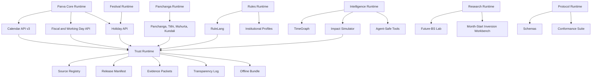

# Project Parva 10/10 SOTA Master Plan

## 1. Executive Summary

Blunt truth: Parva can become a 10/10 without cutting its ambition, but not while every subsystem looks equally product ready. The project's problem is not that it has too much scope. The problem is that mature infrastructure, preview protocols, research experiments, consumer UI, trust artifacts, and commercial workflows still live too close together.

The biggest obstacle is maturity confusion. Core BS/AD conversion, source policy, trust manifests, RuleLang, TimeGraph, Impact, Protocol, future-BS research, and consumer panchanga surfaces cannot all carry the same public promise.

The highest-leverage path is:

1. Make **Parva Core** boring, stable, fast, verified, and package-installable.
2. Make **Parva Trust** the credibility layer that proves every public claim.
3. Move future-BS, inversion, model-risk, and client reconciliation into **governed research/private lanes**.
4. Mature Protocol, TimeGraph, Agent, and Impact as **draft or preview products** with hard conformance gates.
5. Turn the frontend and docs into a clear platform story, not a pile of features.
6. Establish one canonical runtime per concept and archive duplicate truth paths after migration.

Current honest score: **6.5/10** as a deeply ambitious technical repo.
After P0 hardening: **7.5/10**.
After platform consolidation: **8.7/10**.
True 10/10 requires external validation, official-source partnerships, audited security, production SLOs, clean canonical runtime boundaries, real adopters, and reproducible trust artifacts that pass from a fresh clone.

External references used:

- [Temporal durable execution](https://docs.temporal.io/)
- [Stripe idempotency](https://docs.stripe.com/api/idempotent_requests)
- [OpenTelemetry signals](https://opentelemetry.io/docs/concepts/signals/)
- [W3C VC Data Model 2.0](https://www.w3.org/TR/vc-data-model/)
- [OpenAPI learning guide](https://learn.openapis.org/introduction.html)
- [AsyncAPI 3.1.0](https://www.asyncapi.com/docs/reference/specification/v3.1.0)
- [GovStack building blocks](https://specs.govstack.global/architecture/4-interoperability-architecture/4.4-building-block-approach)
- [Starlette thread pool docs](https://www.starlette.io/threadpool/)
- [MoHA holidays page](https://www.moha.gov.np/en/page/holidays)
- [MoCIT Digital Nepal Framework page](https://mocit.gov.np/pages/digital-nepal-framework/)
- [Nepal Panchanga Nirnayak Bikas Samiti](https://npns.gov.np/?s=0)

---

## 2. Current Reality of Parva

Parva today is not "a Nepali date converter." It is already trying to be a national temporal infrastructure stack:

| Subsystem | Current reality | Score |
|---|---:|---:|
| Core Calendar | Useful BS/AD conversion with source policy and future gating, but estimated fallback paths still need tighter policy review | 7 |
| Panchanga | Serious astronomical direction, but CPU/runtime boundaries and duplicate tithi paths need consolidation | 6 |
| Festivals | Catalog v4 and precompute direction exist, but v2/v3/v4 naming creates trust friction | 6.5 |
| Holidays | Strong product wedge if tied to MoHA release verification | 6 |
| Fiscal/Working Day | Valuable for fintech and enterprise, needs stronger institution profile model | 6.5 |
| Future-BS | Technically interesting research, but must stay research/private except risk metadata | 6 research, 3 public |
| Trust | Strong instincts: manifests, evidence, logs, offline bundles, drift scripts | 6.5 |
| RuleLang | Good sandbox direction with call/loop limits, still needs policy hardening and PII trace audit | 6.5 |
| TimeGraph | Useful preview abstraction, currently in-memory and public-artifact limited | 4.5 |
| Impact | Good simulator concept, still preview with sample dependency extraction | 4.5 |
| Agent Tools | Good safety framing, not yet ecosystem-grade | 4 |
| Protocol | Strong draft, but not a standard yet | 4.5 |
| SDKs | Present but need one canonical contract and drift gates | 5 |
| Frontend | Better than before, still likely carries god-component and product-story risk | 5.5 |
| Billing | API-key hashing and store exist, but commercial ops remain early | 5 |
| CI/SRE | verify-public and trust-drift exist, but need staged CI lanes and SLOs | 6.5 |

### Existing Finding Status

| Finding | XML status | State | Verify | Remediation | Priority |
|---|---|---|---|---|---|
| Serious calendrical core | Confirmed via calendar, panchanga, tithi, JPL/Swiss direction | Strength | `pytest tests/unit/calendar` | Preserve and isolate canonical runtime | P0 |
| Source-aware metadata | Confirmed across future-BS, trust, protocol schemas | Strength | `scripts/release/verify_public.py` | Collapse duplicate confidence taxonomies | P1 |
| RuleLang sandbox | Confirmed in `rulelang_service.py` with no eval and limits | Strength, partial | RuleLang unit tests plus malicious fixtures | Add policy corpus, PII scrub, call budget metrics | P0 |
| Trust/provenance scripts | Confirmed: `parva_trust_verify.py`, manifests, workflows | Strength | `scripts/parva_trust_verify.py` | Deterministic regeneration from clean clone | P0 |
| Route profiles | Confirmed in `router_registry.py` | Strength, partial | OpenAPI diff per profile | Add contract snapshots for every profile | P0 |
| Future-BS too close to product | Partially fixed by public/private routers | Still open | Public OpenAPI and route smoke | Block AD-to-BS future leakage too, not only BS-to-AD | P0 |
| Duplicate calculator paths | Confirmed: `calculator.py`, `calculator_v2.py`, `catalog_v4.py` | Open | import graph | Canonical service plus compatibility wrappers | P1 |
| Duplicate tithi paths | Confirmed: `tithi.py` and `tithi/` package | Open | import graph | Canonical package, wrapper deprecation | P1 |
| V2/V3/V4/V5 sprawl | Confirmed | Open | route manifest | Version policy and deprecation calendar | P1 |
| Frontend god component | Confirmed: `frontend/src/redesign/ParvaRedesign.jsx` | Open | component size check | Split into routes, shells, feature modules | P1 |
| Resource resolver | Confirmed: `backend/app/core/paths.py` exists | Partial | grep `Path(__file__).parents` | Migrate all runtime resource access | P0 |
| Sync CPU in async routes | Likely | Open | route profiling | move heavy compute to workers/precompute/threadpool | P0 |
| Observance N+1 | Likely from festival use cases | Open | profiler and query count tests | batch observance resolution | P1 |
| SQLite production risk | Mostly handled by startup settings | Partial | production config tests | hard fail all commercial/provenance stores without Postgres | P0 |
| PII in traces/logs | Unknown | Open | grep logs/traces | scrubber plus privacy tests | P0 |
| Broad exceptions | Confirmed many `except Exception` | Open | ruff BLE001 report | reduce by module | P2 |
| Mypy limited | Confirmed by prompt history and likely repo state | Open | mypy group list | expand per critical module | P2 |
| Protocol premature | Confirmed by draft artifacts | Partial | docs wording scan | call it draft until external implementer passes | P1 |
| Large source artifact policy | Exclusions in repomix suggest improved policy | Partial | git tracked file scan | LFS/release artifact policy | P1 |
| SDK duplication | Likely | Open | package inventory | one canonical Python, one JS/TS, one CLI | P1 |
| Manual payment activation | Confirmed billing workflow patterns | Open | billing route review | idempotent provisioning and audit trail | P2 |

---

## 3. The Full-Scope 10/10 Vision

Parva should become a governed temporal platform with seven product lanes:

| Lane | Meaning | Public maturity target |
|---|---|---|
| Parva Core | BS/AD conversion, date validation, fiscal/working-day logic, holidays | Stable |
| Parva Trust | source registry, evidence packets, release manifests, hashes, transparency logs, offline bundles | Stable |
| Parva Rules | RuleLang, institutional profiles, working-day decisions, payroll/banking review gates | Enterprise preview |
| Parva Intelligence | TimeGraph, Impact Simulator, explanation engine, agent-safe claim checker | Developer preview |
| Parva Research | future-BS lab, inversion workbench, model-risk, red-team replays | Private/research preview |
| Parva Protocol | schemas, conformance, credentials, compatibility reports | Draft |
| Parva Consumer | frontend, panchanga, muhurta, kundali, festivals, embeds | Public preview |

10/10 means:

| Dimension | 10/10 definition |
|---|---|
| Engineering | one canonical runtime per domain concept, typed critical paths, no hidden repo-root assumptions, bounded compute, package-installable backend |
| Trust | deterministic manifests, reproducible evidence packets, offline verification, public/private artifact separation, admin-only provenance mutation |
| Security | Argon2id or PBKDF2, safe secrets, production hard-fails unsafe defaults, CORS/CSP, trusted proxy validation, audit logs, PII-safe traces |
| Performance | p95/p99 budgets, heavy compute off request loop, festival precompute, scalable BS lookup, TimeGraph persistence |
| Product | clear wedges for vendors, fintech, government, developers, and consumers, with no future-BS overclaims |
| Protocol | draft until external implementers pass meaningful conformance |
| Research | future-BS is reproducible research with `computed_prediction_not_official`, wrong-GREEN memory, and no public exact future leakage |
| Frontend | capability-aware UI, accessible, fast, split by route and audience |
| SDK/DX | typed SDKs, CLI, examples, OpenAPI drift checks, first call in under 10 minutes |
| Operations | CI lanes, verify-public, trust drift, security scan, docs link check, deployment smoke, rollback plan |

---

## 4. Platform Architecture Blueprint

Target architecture:



### Target Package Structure

```text
backend/app/parva_core/
  calendar/
  fiscal/
  holidays/
  working_day/

backend/app/parva_panchanga/
  tithi/
  nakshatra/
  yoga/
  karana/
  muhurta/
  kundali/

backend/app/parva_trust/
  source_registry/
  manifests/
  evidence/
  transparency_log/
  offline_bundle/

backend/app/parva_rules/
  rulelang/
  profiles/
  evaluators/

backend/app/parva_intelligence/
  timegraph/
  impact/
  agent_tools/

backend/app/parva_research/
  future_bs/
  inversion_workbench/
  red_team/

backend/app/parva_protocol/
  schemas/
  conformance/
  credentials/
```

Do not physically move everything at once. First create canonical boundaries through manifest files and adapter modules, then migrate imports gradually.

### Route Profiles

| Profile | Purpose | Allowed |
|---|---|---|
| `minimal_public` | health and docs smoke | health, metadata |
| `public_demo` | website demo | calendar, fiscal, holidays, safe panchanga, safe capabilities |
| `public_reference` | serious public docs | public API plus trust summaries |
| `developer_preview` | technical evaluation | safe TimeGraph, sample RuleLang, sample Impact |
| `enterprise_preview` | authenticated controlled workflows | impact, rule profiles, audit workflow |
| `research_private` | future-BS research | future-BS predictions, inversion, model runs |
| `internal_lab` | raw source and calibration | private corpora, calibration artifacts |
| `full_dev` | local integration only | everything with warnings |

---

## 5. Canonical Runtime Plan

| Duplicate area | Canonical path | Migration | Tests | Delete/archive criteria |
|---|---|---|---|---|
| `calculator.py` vs `calculator_v2.py` | `app.rules.service.FestivalRuleService` plus `app.rules.catalog_v4` | make old calculator wrapper-only | festival golden tests | no imports except compatibility tests |
| `tithi.py` vs `tithi/` | `app.calendar.tithi` package | move functions into package, wrapper emits deprecation | tithi accuracy and API tests | wrapper only after 2 releases |
| Festival V2/V3/V4 | `catalog_v4` plus rule service | rename public docs to "festival catalog" not v4 | catalog drift tests | old JSON removed after migration |
| v3/v4/v5 APIs | v3 stable, v4/v5 preview/private | route profile contract | OpenAPI profile snapshots | stale route docs archived |
| Future-BS prediction vs risk | research service private, public only capabilities/risk taxonomy | hard gate all exact outputs | public OpenAPI tests | no exact future examples public |
| Source tiers | one schema in protocol and trust runtime | map old labels | schema validation | old aliases stored in compatibility map |
| Confidence labels | canonical confidence model | migrate response models | protocol schema tests | no ad hoc strings |
| SDK paths | `packages/parva-python`, `packages/parva-js`, `parva` CLI | remove duplicated examples | SDK smoke and drift tests | old examples archived |
| Runtime artifacts vs fixtures | artifacts in `data/public` or release bundles, fixtures only synthetic | split test data | public safety grep | future fixtures removed |
| Resource paths | `app.core.paths.resolve_resource_path` | ban direct repo-root traversal | architecture grep | no production `parents[3]` access |

---

## 6. Subsystem Maturity Matrix

| Subsystem | Current maturity | Target | Public exposure | Route profile | CI gate | Owner | Next actions |
|---|---|---|---|---|---|---|---|
| Core Calendar | Beta/stable | Stable | Public | public_demo | core pytest, OpenAPI | Core team | close AD-to-BS future leakage |
| Panchanga | Beta | Stable preview | Public preview | public_reference | latency and correctness | Panchanga team | offload heavy compute |
| Festivals | Beta | Stable | Public | public_demo | catalog drift | Core team | canonicalize catalog |
| Holidays | Beta | Stable | Public | public_demo | MoHA fixture verification | Trust team | build release importer |
| Fiscal/Working Day | Beta | Stable | Public | public_demo | fiscal tests | Core team | institutional profiles |
| RuleLang | Alpha/beta | Enterprise preview | gated | developer/enterprise | sandbox corpus | Rules team | PII trace scrub |
| Trust | Beta | Stable | Public summaries | public_reference | trust verify | Trust team | deterministic bundles |
| TimeGraph | Alpha | Developer preview | limited | developer_preview | graph validation | Intelligence team | persistent graph store |
| Impact | Alpha | Enterprise preview | sample only | enterprise_preview | impact fixtures | Intelligence team | real dependency extraction |
| Agent Tools | Alpha | Developer preview | limited | developer_preview | benchmark suite | Intelligence team | unsupported claim hardening |
| Protocol | Draft | Draft with external impl | Public draft | public_reference | conformance full | Protocol team | version governance |
| Future-BS | Research | Private lab | metadata only | research_private | leakage tests | Research team | inversion workbench |
| Kundali | Alpha | Consumer preview | public if bounded | public_reference | latency tests | Panchanga team | disclaimer and compute budget |
| Muhurta | Alpha | Consumer preview | public if bounded | public_reference | latency tests | Panchanga team | source boundary |
| Frontend | Beta | Public release | Public | public_demo | build/lint/test/smoke | Frontend team | split god component |
| SDKs | Alpha | Stable beta | Public | public_reference | SDK drift | DX team | one canonical SDK each |
| Billing | Alpha | Enterprise ready | Private | enterprise_preview | billing security | Commercial team | idempotent provisioning |
| Docs | Beta | Stripe/Twilio-grade | Public | all | link check | DX team | docs map and maturity labels |
| CI/SRE | Beta | Production-grade | Internal/public status | all | CI matrix | SRE team | SLO and smoke deploy |

---

## 7. Product Strategy

### Best Positioning

The strongest positioning is a combination:

1. **Parva Core** as the reliable wedge.
2. **Parva Trust** as the moat.
3. **Parva Rules** as the enterprise differentiator.
4. **Parva Research** as the long-term technical edge.
5. **Parva Protocol** as the ecosystem play.

Do not lead with "future prediction." Lead with:

> Source-backed Nepali calendar infrastructure for software systems that cannot afford silent BS date errors.

### Segments

| Segment | Realistic now? | Wedge |
|---|---:|---|
| Developers | Yes | free API, SDK, docs, conversion and fiscal logic |
| ERP/HRMS/payroll vendors | Yes | fiscal/working-day validation, holiday release updates |
| Cooperatives/microfinance | Medium | BS date-risk audit, loan schedule mismatch reports |
| Large banks | Long-term | audited deployment, SLA, references required |
| Government | Long-term but strategically important | machine-readable holiday/calendar release toolkit |
| Panchanga authority | Long-term | digitization and verification workflow, no authority replacement |
| Students/researchers | Yes | open datasets, protocol drafts, calendar computing docs |
| Open source community | Yes | SDKs, conformance, issue labels, good first tasks |

### Wedges

1. Machine-readable MoHA holiday release toolkit.
2. Source-backed fiscal/working-day API.
3. Vendor conformance suite for BS conversion.
4. Offline verification bundle.
5. BS date-risk audit for financial schedules.
6. Agent-safe Nepali time tools.
7. Panchanga evidence and method explorer.

Banks will not care because "calendar is cool." They will care when Parva shows one of these:

- real mismatch caught in a schedule,
- audit workflow reduces operational risk,
- official release ingestion is faster and safer,
- vendor conformance report proves their system is wrong.

---

## 8. Government and Public Infrastructure Plan

Nepal context matters. MoHA publicly lists holiday notices including 2080, 2081, 2082, and 2083 on its holidays page. NPNS presents itself as a Government of Nepal body under the Ministry of Culture, Tourism and Civil Aviation and publishes panchanga downloads and wall-calendar approval notices. MoCIT's site currently shows Digital Nepal Framework related materials and notices. This makes Parva's government story plausible, but only if it is framed as infrastructure support, not authority replacement.

### One-Page Proposal

Title:
**Machine-readable Nepali Calendar and Holiday Release Toolkit**

Sections:

1. Problem: official dates are published for humans, but software systems need signed machine-readable releases.
2. Pilot: digitize one MoHA holiday release into JSON, CSV, PDF evidence, hash manifest, and OpenAPI endpoint.
3. Governance: official source remains authority.
4. Deliverables: schema, release manifest, verification script, public sample portal.
5. Safety: Parva does not issue official dates.
6. Benefit: fewer calendar inconsistencies across government and private systems.

### What Not To Pitch

- Do not pitch future-BS prediction.
- Do not pitch replacing NPNS.
- Do not pitch legal authority.
- Do not pitch "AI calendar."
- Do not pitch broad 99 percent claims.

### 30/60/90 Days

| Time | Actions |
|---|---|
| 30 days | prepare MoHA holiday release demo, source registry, one-page brief, public verification page |
| 60 days | meet software vendors first, collect mismatch examples, refine government proposal with evidence |
| 90 days | approach MoHA/MoCIT/NPNS with a small pilot, not a platform takeover |

Stakeholder map:

- MoHA: public holiday publication.
- NPNS: panchanga and calendar approval source.
- MoCIT: digital infrastructure and interoperability.
- National Statistics/Data Portal stakeholders: data publication patterns.
- Vendors: ERP, HRMS, payroll, finance, municipal software.

---

## 9. Engineering Remediation Plan

### P0

| Task | Files/modules | Direction | Tests | Verify | Done |
|---|---|---|---|---|---|
| Public future conversion policy | `calendar_conversion_service.py`, `bikram_sambat.py`, `calendar/routes.py` | gate AD-to-BS and dual-month future exact estimates, not only BS-to-AD | public route tests | `pytest tests/unit/calendar tests/accuracy` | no exact unverified future public output |
| verify-public green from fresh clone | `scripts/release/verify_public.py`, workflows | make it the release gate | CI | `py -3.11 scripts/release/verify_public.py` | passes without local hidden files |
| Route-profile contract | `router_registry.py` | snapshot routes per profile | OpenAPI profile tests | profile smoke script | no private route in public |
| Resource resolver migration | `core/paths.py`, all runtime modules | ban repo-root traversal | architecture grep | `rg "parents\\[|Path\\(__file__"` | only resolver allowed |
| CPU offload | panchanga, kundali, muhurta, festival routes | sync route or worker/process pool/precompute | latency tests | Locust/k6 smoke | no heavy CPU on event loop |
| SQLite production rejection | settings, billing, trust stores | hard fail production local stores | config tests | startup tests | Postgres required for prod |
| PII trace scrub | RuleLang, agent, impact, logs | classify/scrub inputs and traces | privacy tests | grep known PII fixtures | no PII in logs/traces |
| Admin provenance security | trust/admin routes | token/role/idempotency/audit | admin tests | security tests | all provenance mutation audited |

### P1

| Task | Direction |
|---|---|
| Festival canonicalization | migrate to `FestivalRuleService` and `catalog_v4`; old calculators wrapper-only |
| Tithi canonicalization | package is source of truth; `tithi.py` wrapper-only |
| Observance batching | batch festival and observance resolution by date range |
| Billing store index audit | explain plans for API key, usage, customer, webhook tables |
| RuleLang policy corpus | malicious, large, recursive, official-claim, future-date fixtures |
| Trust bundle determinism | rebuild bundle twice and compare hashes |
| Protocol conformance full | invalid fixtures must fail, compatibility reports generated |
| Frontend split | `ParvaRedesign.jsx` becomes shell plus feature routes |

### P2

| Task | Direction |
|---|---|
| Broad exception cleanup | reduce `except Exception` module by module |
| Mypy expansion | start core calendar, trust, rulelang, billing, protocol |
| SDK consolidation | one Python package, one JS/TS package, one CLI |
| Large artifact policy | Git LFS or release artifacts for source archives and kernels |
| Docker JPL reproducibility | no year-tied build cache; explicit kernel fetch/verify step |

### P3

| Task | Direction |
|---|---|
| External conformance program | invite one vendor or student project |
| Public benchmark dashboard | only safe metrics |
| Multi-tenant enterprise controls | audited orgs, keys, quotas, logs |
| Formal protocol governance | RFC process and maintainers |

---

## 10. Security and Privacy Plan

Target controls:

| Area | Required state |
|---|---|
| API keys | PBKDF2 now is acceptable; Argon2id preferred later; pepper required in production |
| Authentication | API keys for partners, admin tokens for internal mutation, no hidden dev credentials |
| Authorization | scopes per route family: `calendar.read`, `trust.read`, `billing.admin`, `research.private` |
| Idempotency | all POST mutation routes require idempotency keys, following Stripe-style retry safety |
| Audit logging | billing, key creation/revoke, source mutation, release publishing |
| CSRF | any cookie-auth admin UI must enforce CSRF; API-key routes can remain header auth |
| CORS/CSP | explicit origins only; no wildcard in production |
| Trusted proxy | no `*` outside local/test |
| Rate limiting | Redis required in production; fail closed or degrade explicitly on outage |
| Request limits | max JSON size, max rule steps, max graph diff size, max impact dependencies |
| RuleLang | no eval/import/network/file/env/shell; loop, call, trace, payload limits |
| PII | reason traces and logs scrub names, emails, phone, citizenship IDs, account numbers |
| Secret scanning | CI plus pre-commit |
| Dependency scanning | Dependabot, pip-audit, npm audit, safety policy |
| Threat model | document STRIDE per subsystem |

Verification:

```powershell
py -3.11 -m pytest tests/unit/bootstrap tests/unit/billing tests/security
py -3.11 scripts/release/verify_public.py
pip-audit
npm --prefix frontend audit --audit-level=high
```

---

## 11. Trust, Provenance, and Data Governance Plan

Parva Trust should be the heart of the product.

### Source Tiers

| Tier | Use |
|---|---|
| Official | MoHA, NPNS, Gazette, official releases |
| Semi-official | authority-adjacent published documents |
| Printed verified | identifiable printed panchanga/calendar |
| Public witness | public dated newspaper/masthead/web record |
| Publisher reference | calendar publishers |
| Software/table reference | open-source/static lookup comparison |
| Third-party | market-shadow comparison only |
| Research/private | model calibration and red-team only |

### Trust Artifact Lifecycle

1. Source acquired.
2. Source normalized.
3. Evidence packet generated.
4. Release manifest generated.
5. Transparency log entry appended.
6. Offline bundle built.
7. Public verification passes.
8. Drift check scheduled.
9. If source changes, diff and review.

Acceptance:

```powershell
py -3.11 scripts/parva_trust_verify.py
py -3.11 tools/validate_schemas.py
py -3.11 scripts/release/verify_public.py
```

Storage:

- Public verified artifacts in repo or release assets.
- Heavy source archives in release artifacts, object storage, or Git LFS.
- Private source archives outside public Git.
- JPL kernels outside Git with checksum download script.

---

## 12. Future-BS Research Plan

Do not delete future-BS. Govern it.

### Public

Allowed:

- capability summary,
- methodology summary,
- source policy,
- claim boundary,
- risk label taxonomy,
- aggregate validation posture.

Not allowed publicly by default:

- exact future month lengths,
- future month-start dates,
- full future export,
- model runs,
- residuals,
- client comparison,
- private calibration.

### Private Research

Keep:

- hidden-rule inversion,
- month-start workbench,
- solar ingress features,
- cutoff-distance features,
- regime detection,
- false-GREEN memory,
- red-team replays,
- source independence modeling,
- official/printed promotion workflow.

### Publication Rules

A future-BS result is publishable only when:

1. no target-year leakage,
2. source policy allows it,
3. official/printed/public validation is clear,
4. prediction set is narrow,
5. false-GREEN memory has no unresolved analog,
6. labeled `computed_prediction_not_official`.

The product claim should be:

> Parva detects future BS calendar risk.

Not:

> Parva knows official future dates.

---

## 13. Protocol and Conformance Plan

Protocol must remain "draft" until external implementers pass.

### Maturity Stages

| Stage | Criteria |
|---|---|
| Draft | schemas exist, examples validate |
| Alpha conformance | Parva implementation passes valid and invalid fixtures |
| Beta conformance | one external implementation passes |
| Candidate standard | governance body, version freeze, compatibility policy |
| Standard | multi-implementer adoption and public governance |

### Required Protocol Work

- JSON Schema strictness where contracts should be strict.
- AsyncAPI for webhooks and event flows.
- OpenAPI drift checks for route profiles.
- Conformance reports with pass/fail evidence.
- Credential status clearly aligned with W3C VC concepts, but not claiming W3C certification.
- Offline verification that works without live API.

Verification:

```powershell
py -3.11 tools/validate_schemas.py
py -3.11 scripts/parva_protocol_verify.py
py -3.11 scripts/parva_conformance.py --level full
```

---

## 14. Frontend and UX Plan

Current risks:

- god component likely still exists,
- public product story can blur panchanga app vs infrastructure,
- capability-aware route gating needs to be visible,
- frontend must never expose private future values,
- enterprise/developer/consumer lanes need separation.

### Target Route Architecture

```text
/
  platform landing
/today
  consumer panchanga today
/calendar
  conversion tools
/festivals
  observances
/developers
  API quickstart, SDKs
/trust
  source policy, release verification
/enterprise
  private deployment and audit workflows
/research
  future-BS methodology only
/protocol
  draft protocol and conformance
```

### Component Split

```text
frontend/src/
  app/
    routes/
    shells/
    config/
  features/
    calendar/
    festivals/
    panchanga/
    trust/
    developers/
    enterprise/
    research/
  components/
    layout/
    cards/
    forms/
    evidence/
  styles/
    tokens.css
    layout.css
```

UX acceptance:

- no horizontal overflow at 360, 390, 768, 982, 1024, 1280, 1440 widths,
- API errors show retry and Render wake-up messaging,
- evidence shown human-readable, not raw IDs,
- claim boundary visible for research,
- Lighthouse performance/accessibility budgets.

Verification:

```powershell
npm --prefix frontend run build
npm --prefix frontend run lint
npm --prefix frontend run test
```

---

## 15. SDK and Developer Experience Plan

Canonical DX:

| Surface | Target |
|---|---|
| Python SDK | typed package, retries, timeout config, safe examples |
| JS/TS SDK | typed ESM/CJS or ESM-only with docs, retries |
| CLI | `parva today`, `parva convert`, `parva verify-bundle`, `parva conformance` |
| OpenAPI | profile-specific specs |
| Examples | calendar, fiscal, holidays, source policy, offline verify |
| Docs | first successful API call in under 10 minutes |

SDK rules:

- no private future-BS examples,
- no future vectors,
- no raw hidden endpoints,
- retries use exponential backoff,
- POST supports idempotency keys,
- generated clients tested against OpenAPI snapshots.

---

## 16. Performance and Scalability Plan

### Route Budgets

| Route family | p95 target | Notes |
|---|---:|---|
| health | 50 ms | no dependencies |
| today/calendar convert | 100 ms | pure lookup/cache |
| fiscal/working day | 150 ms | cache profiles |
| holidays/festivals upcoming | 200 ms cached | precompute |
| panchanga today | 400 ms cached | isolate astronomy |
| kundali/muhurta | async job or private | no public blocking |
| TimeGraph | 300 ms | persistent index |
| Impact | async/private | no unbounded POST |
| Protocol verify | offline script | not request path |

Starlette/FastAPI guidance matters here: synchronous work may use a thread pool, but thread pool capacity is finite. CPU-heavy panchanga/kundali/muhurta should be precomputed, sent to workers, or isolated from public async routes.

Infrastructure:

- Postgres for billing, trust logs, TimeGraph.
- Redis for rate limiting, cache, task queues.
- Worker process for heavy astronomy and impact simulations.
- Object storage for large artifacts.
- OpenTelemetry traces, metrics, logs.
- SLO dashboard.

---

## 17. Testing and CI Plan

| CI lane | Trigger | Command | Pass criteria |
|---|---|---|---|
| Core backend | PR/push | `py -3.11 -m pytest tests/unit/calendar tests/unit/fiscal` | all pass |
| Public verification | PR/push | `py -3.11 scripts/release/verify_public.py` | all public gates pass |
| Route safety | PR/push | profile OpenAPI tests | no private routes public |
| Trust drift | scheduled daily | `py -3.11 scripts/parva_trust_verify.py` | no drift |
| Schemas | PR/push | `py -3.11 tools/validate_schemas.py` | all valid and examples pass |
| Protocol | PR/push | `py -3.11 scripts/parva_protocol_verify.py` | conformance artifacts valid |
| Frontend | PR/push | `npm --prefix frontend run build && npm --prefix frontend run test` | green |
| SDK Python | PR/push | `py -3.11 -m pytest packages/parva-python/tests` | green |
| SDK JS | PR/push | `npm --prefix packages/parva-js test` | green |
| Type | PR/push | `mypy backend/app/parva_core backend/app/parva_trust` | no new errors |
| Lint | PR/push | `ruff check backend scripts tests` | green |
| Security | daily/PR | pip-audit, npm audit, secret scan | no high untriaged |
| Docs | PR/push | link checker | no broken public links |
| Performance smoke | nightly | route latency smoke | under budget |
| Deployment smoke | release | public URL checks | healthy |

---

## 18. Documentation and Messaging Plan

Docs structure:

```text
docs/
  current/
    API_QUICKSTART.md
    DEPLOYMENT.md
    PUBLIC_API_BOUNDARY.md
    SECURITY.md
    OPERATIONS.md
  trust/
    SOURCE_POLICY.md
    RELEASE_MANIFESTS.md
    OFFLINE_BUNDLES.md
    TRANSPARENCY_LOG.md
  protocol/
    STATUS.md
    CONFORMANCE.md
    GOVERNANCE.md
    SCHEMAS.md
  research/
    FUTURE_BS_RESEARCH.md
    CLAIM_BOUNDARY.md
    MODEL_RISK.md
  enterprise/
    FISCAL_WORKING_DAY.md
    RECONCILIATION_WORKFLOW.md
    PRIVATE_DEPLOYMENT.md
  government/
    HOLIDAY_RELEASE_TOOLKIT.md
    MACHINE_READABLE_CALENDAR_PROPOSAL.md
  internal_archive/
    stale docs, historical reports
```

What not to say publicly:

- "official future calendar"
- "guaranteed future dates"
- "99 percent future accuracy"
- "replacement for NPNS"
- client/prospect names
- full future vectors
- model internals and thresholds

What to say:

- source-aware,
- reproducible,
- audit-friendly,
- computed outputs are not official,
- official publications override computation.

---

## 19. Dead Code and Useless File Removal Plan

Do not delete unfinished research just because it is unfinished. Delete or archive only when it meets objective criteria.

### Deletion Criteria

A file can be deleted when:

1. no imports,
2. no route registration,
3. no tests reference it,
4. no docs reference it,
5. no release artifact depends on it,
6. replacement has passed compatibility tests,
7. deprecation notice has shipped if public.

### Methods

```powershell
rg "module_name"
py -3.11 scripts/architecture/import_graph.py
py -3.11 scripts/release/verify_public.py
npm --prefix frontend run build
```

Categories:

- generated caches: delete,
- stale private reports: remove from tracking,
- obsolete docs: move to `docs/internal_archive`,
- compatibility shims: keep until deprecation ends,
- duplicate CSS/assets: remove after visual regression,
- future fixtures: replace with synthetic or historical samples,
- source archives: move to private storage or release artifacts.

---

## 20. Team and Resource Plan

Assuming no limits:

| Team | Responsibilities |
|---|---|
| Core Calendar | BS/AD, fiscal, holidays, working-day, panchanga core |
| Research | future-BS, inversion, astronomy, benchmarks, source acquisition |
| Trust/Protocol | manifests, evidence, schemas, conformance, offline bundles |
| Backend Platform | FastAPI, route profiles, storage, performance, workers |
| Security | threat model, auth, audit, secret scanning, privacy |
| SRE | CI/CD, deploy, observability, SLOs, incident response |
| Frontend/Design | public UI, docs UI, evidence UX, demos |
| DX/SDK | SDKs, CLI, examples, docs, OpenAPI |
| QA/Conformance | golden tests, invalid fixtures, compatibility reports |
| Product/Government | pilots, MoHA/NPNS/MoCIT outreach, vendor workflows |

Coordination:

- weekly architecture council,
- monthly protocol review,
- release manager owns public safety,
- research lead owns claim boundaries,
- security lead can block releases.

---

## 21. Roadmap

### 2-Week Red-Check Sprint

Deliver:

- public future conversion leakage audit,
- verify-public green,
- route profile snapshots,
- public OpenAPI safety,
- PII trace scrub baseline,
- frontend no sensitive leaks,
- docs claim scan.

### 30-Day Stabilization

Deliver:

- canonical runtime manifest,
- resource resolver migration,
- festival/tithi migration plan,
- trust bundle deterministic rebuild,
- SDK drift tests,
- production config hard-fail tests,
- docs map and maturity labels.

### 90-Day Platform Consolidation

Deliver:

- Parva Core stable release,
- Parva Trust stable release,
- Protocol alpha conformance,
- enterprise preview for RuleLang and Impact,
- TimeGraph persistent prototype,
- government holiday release demo,
- frontend route split.

### 6-Month SOTA Productization

Deliver:

- official-source workflow pilot,
- vendor conformance suite,
- full SDKs and CLI,
- production SLO dashboard,
- audited security pass,
- private future-BS research lab with inversion workbench,
- external beta users.

### 12-Month Ecosystem

Deliver:

- multiple implementers,
- public conformance registry,
- official or semi-official data collaboration,
- enterprise deployments,
- publishable research paper or technical report,
- protocol candidate status.

---

## 22. Risk Register

| Risk | Severity | Likelihood | Impact | Mitigation | Owner | Verification |
|---|---:|---:|---|---|---|---|
| Future-BS overclaim | Critical | High | credibility loss | strict claim boundary | Research | public grep |
| Private route exposure | Critical | Medium | data leak | route profile tests | Backend | OpenAPI snapshots |
| Wrong date in fintech use | Critical | Medium | financial harm | source policy and review labels | Core | golden tests |
| Official authority confusion | High | High | reputational/legal | disclaimers and source hierarchy | Product | docs scan |
| Duplicate truth paths | High | High | inconsistent outputs | canonical runtime plan | Architecture | import graph |
| CPU-heavy route outage | High | Medium | downtime | workers/precompute | SRE | load tests |
| SQLite in production | High | Medium | data loss | startup hard-fail | Backend | config tests |
| PII in traces | High | Medium | privacy incident | scrubber | Security | privacy tests |
| Protocol called standard too early | Medium | High | credibility loss | draft governance | Protocol | docs scan |
| Trust bundle drift | High | Medium | broken verification | scheduled drift | Trust | CI |
| Government non-adoption | Medium | High | slow traction | vendor-first proof | Product | pilot metrics |
| Vendor indifference | Medium | Medium | weak market | conformance/audit demos | Product | conversations |
| Broad exception masks bugs | Medium | High | hidden failures | exception cleanup | Backend | ruff |
| Dependency vulnerabilities | High | Medium | compromise | Dependabot and audit | Security | CI |
| Frontend product confusion | Medium | High | weak outreach | route/audience split | Design | UX review |

---

## 23. Success Metrics

| Metric | Target |
|---|---:|
| verify-public pass rate | 100 percent on main |
| trust drift incidents | 0 unresolved |
| public OpenAPI private route leaks | 0 |
| public future exact value leaks | 0 unless explicitly allowed |
| core conversion golden tests | 100 percent |
| route p95 | under budgets in section 16 |
| docs time-to-first-call | under 10 minutes |
| SDK smoke success | Python and JS green every release |
| conformance valid/invalid cases | 200+ meaningful fixtures |
| external implementers | 2 within 12 months |
| vendor pilots | 3 within 6 months |
| government meetings | 3 qualified within 6 months |
| duplicate modules reduced | 80 percent reduction after migration |
| mypy coverage | critical runtime modules covered |
| escaped date bugs | 0 critical |
| wrong-GREEN future-BS public claims | 0 |

---

## 24. Final Prioritized Backlog

| ID | Title | Priority | Subsystem | Owner | Files/modules | Tests | Definition of done |
|---|---|---|---|---|---|---|---|
| P0-001 | Close public future conversion leakage | P0 | Core/Future-BS | Core | `calendar_conversion_service.py`, `bikram_sambat.py`, routes | public route tests | no exact unverified future output |
| P0-002 | Route profile OpenAPI snapshots | P0 | API | Backend | `router_registry.py`, tests | OpenAPI tests | profiles locked |
| P0-003 | Deterministic public verification | P0 | Release | SRE | `verify_public.py`, workflows | CI | fresh clone passes |
| P0-004 | Resource resolver enforcement | P0 | Backend | Platform | `core/paths.py`, all runtime modules | architecture grep | no hidden repo-root runtime |
| P0-005 | PII trace scrubber | P0 | Security | Security | RuleLang, agent, impact, logging | privacy fixtures | no PII in traces |
| P0-006 | Production store hard-fail | P0 | Billing/Trust | Backend | settings, billing storage | config tests | no SQLite prod |
| P0-007 | Heavy compute boundary | P0 | Panchanga | SRE/Core | panchanga/kundali/muhurta routes | latency/load | no CPU-heavy async blocking |
| P0-008 | Trust bundle rebuild proof | P0 | Trust | Trust | trust scripts, manifests | hash tests | two rebuilds same hash |
| P1-001 | Festival canonical runtime | P1 | Festivals | Core | calculator files, rule service | festival tests | one source of truth |
| P1-002 | Tithi canonical runtime | P1 | Panchanga | Core | `tithi.py`, `tithi/` | tithi tests | wrapper-only legacy |
| P1-003 | Protocol conformance full | P1 | Protocol | Protocol | schemas, fixtures, scripts | conformance full | invalid fixtures fail |
| P1-004 | SDK contract drift | P1 | DX | DX | packages | SDK tests | generated docs match API |
| P1-005 | Frontend route split | P1 | Frontend | Design | `frontend/src` | build/test/smoke | no god component |
| P1-006 | Observance batching | P1 | Festivals | Backend | festival use cases | perf tests | no N+1 pattern |
| P1-007 | Government holiday release demo | P1 | Product/Trust | Product | docs, importer, sample | trust verify | MoHA release sample verified |
| P1-008 | Future-BS inversion workbench private | P1 | Research | Research | future_bs lab | leakage tests | private only |
| P2-001 | Broad exception cleanup | P2 | Backend | Platform | modules with BLE001 | ruff | reduced by 70 percent |
| P2-002 | Mypy critical modules | P2 | Backend | Platform | core/trust/rules/billing | mypy | no critical errors |
| P2-003 | Billing idempotency | P2 | Billing | Commercial | billing routes/store | billing tests | safe retries |
| P2-004 | AsyncAPI webhook spec | P2 | Protocol | Protocol | schemas/docs | schema tests | events documented |
| P2-005 | Large artifact policy | P2 | Data | Trust | docs/scripts/gitignore | repo scan | no heavy private artifacts |
| P3-001 | External implementer program | P3 | Protocol | Product | docs/conformance | external report | first external pass |
| P3-002 | SLO dashboard | P3 | SRE | SRE | telemetry | smoke/load | SLO visible |
| P3-003 | Vendor audit pilot | P3 | Product | Product | enterprise docs/tools | pilot report | one vendor workflow audited |

---

## 25. Final Verdict

Current score: **6.5/10**.

Parva is already much stronger than a normal calendar API repo. It has real domain ambition, source-policy instincts, route gating, trust artifacts, protocol scaffolding, SDK work, frontend work, and research depth. The strength is real.

But 10/10 requires discipline equal to the ambition. The project cannot look like every route, schema, model, and document is equally mature. It needs a governed platform model.

Score after P0 fixes: **7.5/10**.
Score after platform consolidation: **8.7/10**.
True 10/10 requires:

- one canonical runtime per concept,
- public verification passing from a fresh clone,
- official-source ingestion workflow,
- airtight public/private boundaries,
- external conformance,
- production observability,
- audited security,
- real pilots,
- documentation at Stripe/Twilio quality,
- no broad future-BS overclaims.

What must be avoided:

- turning future-BS into public prophecy,
- calling the protocol a standard too early,
- shipping private routes in public OpenAPI,
- keeping duplicate calculators forever,
- letting preview systems pretend to be stable,
- letting trust artifacts depend on local hidden state.

Single highest-leverage next action:

**Run a two-week red-check sprint focused only on public future conversion safety, route-profile OpenAPI snapshots, deterministic verify-public, resource resolver enforcement, and trust bundle reproducibility.**

That sprint turns Parva from "impressive ambitious repo" into "credible infrastructure platform with governed maturity lanes."
