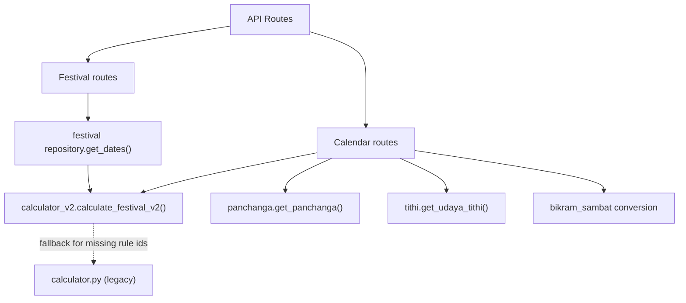

# Year 1 Week 1 — Calculator Code Path Map

## Scope
- Runtime call paths in backend routes/repository.
- Non-runtime call paths (tests/tools/docs) that still import legacy APIs.

## Runtime Path Summary

## V2 Call Sites (Active Runtime)

| File | Line(s) | Symbol(s) | Runtime Status |
|---|---:|---|---|
| `backend/app/festivals/repository.py` | 27-29, 456 | `calculate_festival_v2`, `list_festivals_v2` | Active |
| `backend/app/festivals/routes.py` | 31-33, 94, 132, 172, 239 | `get_upcoming_festivals_v2`, `get_festivals_on_date_v2` | Active |
| `backend/app/calendar/routes.py` | 427, 431, 464, 472, 482 | `calculate_festival_v2`, `list_festivals_v2` | Active |
| `backend/app/calendar/__init__.py` | 58-63, wrappers | v2 wrappers exported as compatibility API | Active |
| `backend/tools/evaluate.py` | 196, 202 | `calculate_festival_v2` | Active evaluation path |
| `backend/tools/evaluate_v2.py` | 55, 64 | `calculate_festival_v2` | Active evaluation path |
| `backend/tools/generate_snapshot.py` | 18, 40 | `calculate_festival_v2`, `list_festivals_v2` | Active provenance path |

## V1 / Legacy Call Sites

| File | Line(s) | Symbol(s) | Runtime Status | Action |
|---|---:|---|---|---|
| `backend/app/calendar/calculator.py` | module | Legacy festival rule engine | Legacy module | Keep for transition only |
| `backend/app/calendar/calculator_v2.py` | 164 | fallback import to `calculate_festival_date` | Active fallback | Replace with explicit migrated rules or adapter |
| `backend/app/calendar/__init__.py` | 54-57 | imports `DateRange`, `CalendarRule` from legacy | Active types-only dependency | Move shared types out of `calculator.py` |
| `tests/unit/calendar/test_calculator.py` | multiple | direct legacy calculator tests | Tests only | Keep until migration complete |
| `backend/tests/test_ephemeris.py` | multiple | imports legacy calculator symbols | Tests only | Migrate to v2 wrappers |
| `tests/unit/calendar/test_nepal_sambat.py` | 61-64 | legacy calculator usage | Tests only | Migrate to v2 wrappers |

## Rule Coverage Snapshot

| Source | Festival Count | Notes |
|---|---:|---|
| `festival_rules_v3.json` | 21 | V2 native lunar-month model |
| `festival_rules.json` | 47 | Legacy rule set |
| Overlap | 21 | V3 ids are subset of legacy ids |
| Legacy-only | 26 | Requires migration to avoid fallback dependency |

Legacy-only ids currently include: `bisket-jatra`, `ram-navami`, `rato-machhindranath`, `ubhauli`, `udhauli`, multiple lhosar variants, and others.

## Key Findings
1. Runtime endpoints are mostly on V2 already.
2. V2 still depends on V1 for non-V3 festival ids.
3. Compatibility wrappers in `backend/app/calendar/__init__.py` hide this dependency.
4. Tests still validate legacy APIs and must be split into:
   - legacy compatibility tests
   - v2 contract tests.

## Week 1 Migration Implications
1. “Zero V1 import in active route” is achievable.
2. “Zero V1 dependency in runtime” is **not** achievable without migrating 26 legacy-only rules.
3. Recommended path:
   - keep temporary fallback during Week 2,
   - migrate missing rules into V3-compatible format,
   - remove fallback after parity gate passes.
